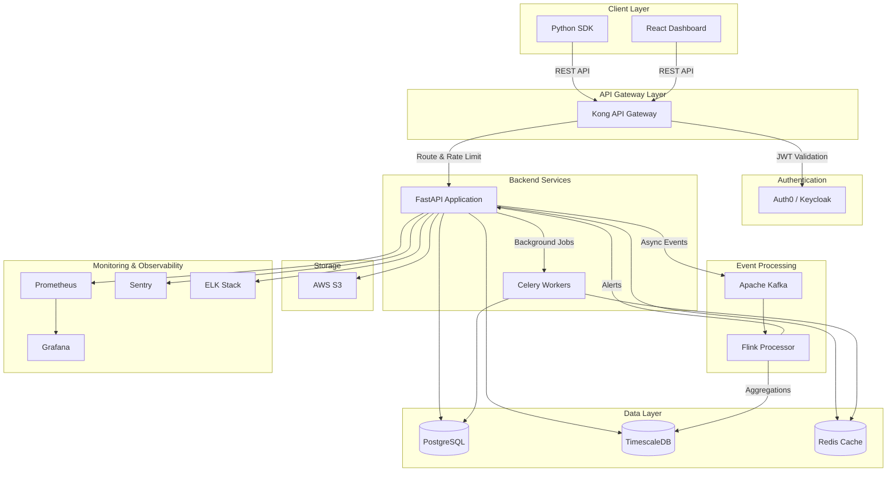

# Cognive Agentic AI Ops Platform - Tech Stack

## Overview

This document outlines the comprehensive technology stack for the Cognive Agentic AI Ops Platform, an enterprise-grade control plane for managing, governing, and operating autonomous AI agents.

**Stack Philosophy:** This tech stack prioritizes **FREE, open-source, production-ready technologies** as the primary choice. All 31 stories in Epic 1 (Foundation & Architecture) have been updated to use a $0 infrastructure cost approach, with optional paid AWS/cloud alternatives documented for enterprise scale requirements.

---

## 🆓 FREE Production-Ready Stack (Primary)

### Quick Summary

All components below are:
- ✅ **100% Free** - No licensing costs
- ✅ **Open Source** - No vendor lock-in
- ✅ **Production-Ready** - Battle-tested by major companies
- ✅ **Self-Hosted** - Run on your own infrastructure or Oracle Cloud Always Free

| Component | Technology | Alternative (Paid) | Cost Savings |
|-----------|-----------|-------------------|--------------|
| **Container Orchestration** | k3s / MicroK8s | AWS EKS ($0.10/hr = $73/mo) | **$73/mo** |
| **API Gateway** | Traefik / Kong (OSS) | AWS API Gateway (~$3.50/million) | **$20-50/mo** |
| **Database** | PostgreSQL 15+ (self-hosted) | AWS RDS ($50-200/mo) | **$50-200/mo** |
| **Time-Series DB** | TimescaleDB (extension) | AWS Timestream ($0.50/GB) | **$30-100/mo** |
| **Cache** | Redis 7 (self-hosted) | AWS ElastiCache ($50/mo) | **$50/mo** |
| **Object Storage** | MinIO (S3-compatible) | AWS S3 ($23/TB/mo) | **$10-50/mo** |
| **Message Queue** | RabbitMQ | AWS SQS ($0.40/million) | **$10-30/mo** |
| **CI/CD** | GitHub Actions (free tier) | CircleCI ($30/mo) | **$30/mo** |
| **Monitoring** | Prometheus + Grafana | Datadog ($31/host/mo) | **$150-300/mo** |
| **Logging** | Loki + Promtail | Datadog Logs ($0.10/GB) | **$50-200/mo** |
| **Error Tracking** | GlitchTip (Sentry OSS) | Sentry Team ($26/mo) | **$26/mo** |
| **Uptime Monitoring** | Uptime Kuma | UptimeRobot Pro ($7/mo) | **$7/mo** |
| **Distributed Tracing** | Grafana Tempo | Datadog APM ($31/host/mo) | **$150/mo** |
| **Background Tasks** | Celery + Flower | AWS Lambda (~$20/mo) | **$20/mo** |
| **Infrastructure as Code** | Terraform (OSS) | Terraform Cloud ($20/user/mo) | **$20/mo** |
| | | **Total Savings:** | **~$876-1,356/month** |

### Complete Free Stack Architecture

```
┌─────────────────────────────────────────────────────────┐
│                     Client Layer                        │
│  • Python SDK (free)                                    │
│  • React Dashboard (free)                               │
└─────────────────────────────────────────────────────────┘
                          ↓
┌─────────────────────────────────────────────────────────┐
│              API Gateway: Traefik / Kong (OSS)          │
│  • Rate limiting • SSL termination • Load balancing     │
└─────────────────────────────────────────────────────────┘
                          ↓
┌─────────────────────────────────────────────────────────┐
│           Backend: FastAPI + Uvicorn (free)             │
│  • REST API • WebSocket • Async processing              │
└─────────────────────────────────────────────────────────┘
           ↓              ↓              ↓
┌──────────────┐  ┌──────────────┐  ┌──────────────┐
│ PostgreSQL + │  │  Redis Cache │  │    MinIO     │
│ TimescaleDB  │  │    (free)    │  │ (S3-compat)  │
│   (free)     │  │              │  │    (free)    │
└──────────────┘  └──────────────┘  └──────────────┘
                          ↓
┌─────────────────────────────────────────────────────────┐
│     Message Queue: RabbitMQ (free)                      │
│  • Async events • Task queues • Pub/sub                 │
└─────────────────────────────────────────────────────────┘
                          ↓
┌─────────────────────────────────────────────────────────┐
│          Background Tasks: Celery + Flower              │
│  • Cost aggregation • Report generation • Cleanup       │
└─────────────────────────────────────────────────────────┘
                          ↓
┌─────────────────────────────────────────────────────────┐
│              Monitoring Stack (all free)                │
│  • Prometheus: Metrics collection                       │
│  • Grafana: Visualization & dashboards                  │
│  • Loki: Centralized logging                            │
│  • Tempo: Distributed tracing                           │
│  • Alertmanager: Alert routing                          │
│  • GlitchTip: Error tracking                            │
│  • Uptime Kuma: Uptime monitoring                       │
└─────────────────────────────────────────────────────────┘
                          ↓
┌─────────────────────────────────────────────────────────┐
│      Infrastructure: k3s/MicroK8s + Docker              │
│  • Container orchestration • Auto-scaling • HA          │
└─────────────────────────────────────────────────────────┘
                          ↓
┌─────────────────────────────────────────────────────────┐
│         CI/CD: GitHub Actions (free tier)               │
│  • Automated testing • Docker builds • Deployments      │
└─────────────────────────────────────────────────────────┘
```

### Deployment Options

#### Option 1: Self-Hosted (Any Server)
- **Cost:** Server/VPS cost only
- **Recommended:** Hetzner, DigitalOcean, Linode
- **Specs:** 8GB RAM, 4 vCPU, 160GB SSD = ~$40-50/mo
- **Total:** $40-50/month (vs $900-1,400/mo with AWS managed services)

#### Option 2: Oracle Cloud Always Free Tier
- **Cost:** $0 forever
- **Resources:**
  - 4 ARM-based Ampere cores (3,000 OCPU hours/mo)
  - 24GB RAM
  - 200GB block storage
  - 10TB outbound data transfer
- **Total:** $0/month

#### Option 3: AWS (Hybrid - Free + Minimal Paid)
- Use free services: VPC, IAM, CloudFront (1TB free)
- Pay only for: EC2 (~$30/mo), EBS storage (~$10/mo)
- **Total:** ~$40-50/month

---

## Backend/API Layer

### Primary Framework: **FastAPI (Python 3.11+)**

**Rationale:**
- High performance with async/await support
- Automatic API documentation (OpenAPI/Swagger)
- Native Pydantic validation for request/response models
- Excellent for building REST APIs with type safety
- Large ecosystem and community support

**Alternatives Considered:**
- **Django REST Framework**: More batteries-included, better for rapid prototyping with admin interface
- **Flask**: Lighter weight but requires more manual configuration

**Key Libraries:**
```python
fastapi==0.104.0
uvicorn==0.24.0          # ASGI server
pydantic==2.5.0          # Data validation
sqlalchemy==2.0.23       # ORM
alembic==1.12.0          # Database migrations
python-jose==3.3.0       # JWT handling
passlib==1.7.4           # Password hashing
httpx==0.25.0            # Async HTTP client
celery==5.3.4            # Background tasks
```

---

### API Gateway: **Kong** or **AWS API Gateway**

**Kong (Recommended for self-hosted):**
- Plugin ecosystem (rate limiting, authentication, logging)
- Request/response transformation
- API versioning support
- Load balancing

**AWS API Gateway (Recommended for cloud-native):**
- Fully managed service
- Auto-scaling
- Native AWS integration
- Pay-per-use pricing

**Use Cases:**
- Rate limiting per API key
- Request authentication and routing
- API versioning and deprecation
- Request/response logging

---

## Database Layer

### Primary Database: **PostgreSQL 15+**

**Rationale:**
- ACID compliance for transactional integrity
- JSONB support for flexible metadata storage
- Excellent performance with proper indexing
- Battle-tested for enterprise workloads
- Rich extension ecosystem

**Schema Design:**
```sql
-- Agent Registry
agents (id, name, framework, team, environment, allowed_models, approved_tools, budget_config, created_at, updated_at)

-- Execution Tracking
agent_runs (run_id, agent_id, status, start_time, end_time, duration, error_details)
execution_steps (step_id, run_id, step_type, timestamp, sequence_number, metadata)
llm_calls (call_id, run_id, provider, model, input_tokens, output_tokens, cost, latency)
tool_invocations (invocation_id, run_id, tool_name, status, duration, input, output)

-- Cost & Governance
llm_pricing (id, provider, model, input_cost_per_1k, output_cost_per_1k, effective_date)
budget_limits (id, agent_id, team_id, per_run_limit, daily_limit)
usage_aggregations (id, agent_id, team_id, date, total_tokens, total_cost)

-- Security & RBAC
users (id, email, name, created_at)
roles (id, name, permissions)
user_roles (user_id, role_id, team_id)
audit_logs (id, user_id, action, resource, timestamp, details)
```

**Configuration:**
- Connection pooling (pgbouncer or SQLAlchemy pool)
- Read replicas for analytics queries
- Partitioning for time-series tables (agent_runs, llm_calls)

---

### Time-Series Database: **TimescaleDB**

**Rationale:**
- PostgreSQL extension (same operational model)
- Optimized for time-series queries
- Automatic data retention policies
- Continuous aggregations for real-time metrics

**Use Cases:**
- LLM call logs over time
- Token usage trends
- Cost analysis by day/week/month
- Performance metrics aggregation

**Alternative: ClickHouse**
- Pros: Extremely fast for analytical queries, columnar storage
- Cons: More complex operations, separate database system

---

### Caching: **Redis 7+**

**Rationale:**
- Sub-millisecond latency for reads
- Pub/sub for real-time updates
- TTL support for cache expiration
- Data structures (hashes, sorted sets) for complex caching

**Use Cases:**
- LLM pricing data cache (TTL: 1 hour)
- Budget remaining calculations (real-time)
- API rate limiting counters
- User session management
- Agent configuration cache

**Configuration:**
```yaml
redis:
  max_memory: 4GB
  eviction_policy: allkeys-lru
  persistence: AOF (for critical data)
  clustering: Redis Cluster (for scale)
```

---

## Message Queue & Event Processing

### Message Queue: **Apache Kafka** or **AWS SQS + SNS**

**Apache Kafka (Recommended for high throughput):**

**Rationale:**
- High throughput (millions of messages/sec)
- Event streaming with replay capability
- Exactly-once semantics
- Consumer groups for scaling

**Use Cases:**
- Async event emission from SDK
- Execution event streaming
- Cost calculation pipelines
- Audit log streaming

**Configuration:**
```yaml
topics:
  - agent.runs.events      # Retention: 30 days
  - agent.llm.calls        # Retention: 90 days
  - agent.tool.invocations # Retention: 30 days
  - budget.alerts          # Retention: 7 days
```

**AWS SQS + SNS (Alternative for cloud-native):**
- Fully managed, simpler operations
- Good for moderate volumes (<10k msg/sec)
- Native AWS integration
- Cost-effective for MVP

---

### Stream Processing: **Apache Flink** or **AWS Kinesis**

**Apache Flink:**

**Rationale:**
- Real-time stream processing
- Stateful computations
- Event-time processing with watermarks
- Exactly-once processing guarantees

**Use Cases:**
- Real-time token usage aggregation
- Budget threshold detection
- Cost trend calculations
- Anomaly detection in agent behavior

**AWS Kinesis (Alternative):**
- Managed service
- Native AWS integration
- Good for simpler streaming needs

---

## Python SDK

### Core Libraries

```python
# HTTP & Networking
httpx==0.25.0              # Async HTTP client for API calls
tenacity==8.2.3            # Retry logic with exponential backoff

# Data Validation
pydantic==2.5.0            # Data models and validation

# Async & Concurrency
asyncio                    # Native async support (Python stdlib)
threading                  # Background event emission (stdlib)
queue                      # Thread-safe queues (stdlib)

# LLM Provider Support
openai==1.3.0              # OpenAI API wrapper
anthropic==0.7.0           # Anthropic Claude API wrapper
litellm==1.14.0            # Unified interface for multiple LLMs

# Utilities
python-dotenv==1.0.0       # Environment configuration
structlog==23.2.0          # Structured logging
```

### SDK Architecture

```python
# Core classes
class CogniveClient:
    """Main SDK client for agent registration and run management"""
    def __init__(self, api_key: str, base_url: str)
    def register_agent(self, **metadata) -> Agent
    def start_run(self, agent_id: str) -> AgentRun
    def get_agent(self, agent_id: str) -> Agent

class AgentRun:
    """Context manager for agent run lifecycle"""
    def __enter__(self) -> AgentRun
    def __exit__(self, exc_type, exc_val, exc_tb)
    def log_step(self, step_type: str, metadata: dict)
    def log_llm_call(self, model: str, tokens: dict, latency: float)
    def log_tool_invocation(self, tool_name: str, status: str)
    def end(self, status: str, error: Optional[str] = None)

# Decorators
@cognive.track_llm
def my_llm_call():
    """Automatically captures LLM call metadata"""
    pass

# Event emission
class EventEmitter:
    """Background thread for async event emission"""
    - Queue-based buffering
    - Batch emission (configurable size)
    - Retry with exponential backoff
    - Graceful shutdown
```

### Testing Libraries

```python
pytest==7.4.3              # Testing framework
pytest-asyncio==0.21.1     # Async test support
pytest-cov==4.1.0          # Coverage reporting
responses==0.24.0          # HTTP request mocking
faker==20.1.0              # Test data generation
```

---

## Frontend/Dashboard

### Core Framework: **React 18+ with TypeScript**

**Rationale:**
- Component reusability and composition
- Strong typing with TypeScript
- Large ecosystem and community
- Enterprise adoption and support
- Virtual DOM for performance

**Project Structure:**
```
frontend/
├── src/
│   ├── components/        # Reusable UI components
│   ├── pages/            # Page-level components
│   ├── features/         # Feature-based modules
│   ├── api/              # API client and hooks
│   ├── hooks/            # Custom React hooks
│   ├── store/            # State management
│   ├── utils/            # Utility functions
│   └── types/            # TypeScript types
├── public/
└── tests/
```

**Alternatives:**
- **Vue 3**: Simpler learning curve, progressive framework
- **Svelte**: Smaller bundle size, compile-time framework

---

### UI Component Library: **shadcn/ui + Radix UI**

**Rationale:**
- Accessible by default (ARIA compliant)
- Customizable without fighting abstractions
- Headless components (full styling control)
- Copy-paste approach (no package bloat)
- Modern, clean design

**Key Components:**
- Tables (agent inventory)
- Charts (cost trends)
- Forms (agent registration)
- Modals (run details)
- Command palette (search)

**Alternatives:**
- **Material-UI (MUI)**: Comprehensive, Google Material Design
- **Ant Design**: Enterprise-focused, rich component set
- **Chakra UI**: Simple API, good accessibility

---

### State Management

**TanStack Query (React Query) v5:**

**Rationale:**
- Server state management
- Automatic caching and refetching
- Optimistic updates
- Request deduplication
- Background refetching

**Use Cases:**
- Agent list and details
- Execution run data
- Cost metrics
- Real-time updates

**Zustand:**

**Rationale:**
- Lightweight client state management
- Simple API without boilerplate
- TypeScript support
- DevTools integration

**Use Cases:**
- Dashboard filters and preferences
- UI state (modals, sidebars)
- User session data

---

### Charting: **Recharts** or **Apache ECharts**

**Recharts (Recommended for simplicity):**
- React-native components
- Composable API
- Responsive by default
- Good for standard charts

**Apache ECharts (Recommended for complexity):**
- More chart types
- Better performance for large datasets
- Advanced interactions
- 3D visualizations

**Charts Needed:**
- Line charts (cost trends over time)
- Bar charts (token usage by agent)
- Pie charts (cost breakdown by model)
- Area charts (budget utilization)
- Timeline charts (execution steps)

---

### Build Tools & Development

```json
{
  "dependencies": {
    "react": "^18.2.0",
    "react-dom": "^18.2.0",
    "typescript": "^5.3.0",
    "@tanstack/react-query": "^5.12.0",
    "zustand": "^4.4.7",
    "recharts": "^2.10.0",
    "axios": "^1.6.0",
    "react-router-dom": "^6.20.0",
    "date-fns": "^2.30.0",
    "zod": "^3.22.4"
  },
  "devDependencies": {
    "vite": "^5.0.0",
    "@vitejs/plugin-react": "^4.2.0",
    "tailwindcss": "^3.3.0",
    "postcss": "^8.4.0",
    "autoprefixer": "^10.4.0",
    "eslint": "^8.55.0",
    "@typescript-eslint/parser": "^6.13.0",
    "prettier": "^3.1.0",
    "vitest": "^1.0.0",
    "@testing-library/react": "^14.1.0"
  }
}
```

**Vite Benefits:**
- Lightning-fast HMR (Hot Module Replacement)
- Optimized production builds
- Native ES modules support
- Plugin ecosystem

**Styling: Tailwind CSS**
- Utility-first approach
- Consistent design system
- Rapid development
- Small production bundle (unused classes purged)

---

## Authentication & Security

### Authentication Provider

**Options:**

1. **Auth0 (Recommended for speed to market)**
   - Managed service, minimal setup
   - Enterprise SSO (SAML, OAuth)
   - MFA support
   - User management UI
   - Pricing: Based on MAU (Monthly Active Users)

2. **AWS Cognito**
   - AWS-native, good for AWS deployments
   - User pools and identity pools
   - Lower cost for high volumes
   - Less feature-rich than Auth0

3. **Keycloak (Recommended for self-hosted)**
   - Open source, full control
   - SAML, OAuth 2.0, OpenID Connect
   - User federation (LDAP, AD)
   - No licensing costs
   - Requires operational overhead

**Implementation:**
```python
# FastAPI JWT validation
from fastapi import Depends, HTTPException
from fastapi.security import HTTPBearer, HTTPAuthorizationCredentials
from jose import jwt, JWTError

security = HTTPBearer()

async def verify_token(credentials: HTTPAuthorizationCredentials = Depends(security)):
    try:
        payload = jwt.decode(
            credentials.credentials,
            SECRET_KEY,
            algorithms=["RS256"]
        )
        return payload
    except JWTError:
        raise HTTPException(status_code=401, detail="Invalid token")
```

---

### API Authentication

**API Keys for SDK:**
- UUID-based keys
- Hashed storage (SHA-256)
- Per-key rate limits
- Key rotation support
- Audit logging

**JWT for Dashboard:**
- Short-lived access tokens (15 min)
- Long-lived refresh tokens (30 days)
- Token rotation on use
- Revocation list (Redis)

**Implementation:**
```python
# API Key middleware
class APIKeyMiddleware:
    async def __call__(self, request: Request, call_next):
        api_key = request.headers.get("X-API-Key")
        if not api_key:
            raise HTTPException(401, "API key required")
        
        # Verify and rate limit
        is_valid = await verify_api_key(api_key)
        if not is_valid:
            raise HTTPException(401, "Invalid API key")
        
        return await call_next(request)
```

---

### Secrets Management

**HashiCorp Vault (Recommended for self-hosted)**
- Dynamic secrets
- Secret rotation
- Audit logging
- Multiple auth methods

**AWS Secrets Manager (Recommended for AWS)**
- Managed service
- Automatic rotation
- Native AWS integration
- Simple pricing

**Use Cases:**
- Database credentials
- API keys for external services
- Encryption keys
- OAuth client secrets

---

### Encryption

**In Transit:**
- TLS 1.3 for all API endpoints
- Certificate management (Let's Encrypt or AWS ACM)
- HSTS headers
- Certificate pinning for SDK

**At Rest:**
- PostgreSQL transparent data encryption
- Field-level encryption for PII (pgcrypto)
- Encrypted S3 buckets (SSE-S3 or SSE-KMS)
- Redis encryption (if storing sensitive data)

**Implementation:**
```python
# Field-level encryption
from cryptography.fernet import Fernet

class EncryptedField:
    def __init__(self, key: bytes):
        self.cipher = Fernet(key)
    
    def encrypt(self, value: str) -> bytes:
        return self.cipher.encrypt(value.encode())
    
    def decrypt(self, value: bytes) -> str:
        return self.cipher.decrypt(value).decode()
```

---

## Infrastructure & Deployment

### Container Orchestration: **Kubernetes**

**Rationale:**
- Industry standard for container orchestration
- Self-healing and auto-scaling
- Rolling updates with zero downtime
- Service discovery and load balancing
- Multi-cloud portability

**Managed Options:**
- **AWS EKS**: Deep AWS integration, good tooling
- **Google GKE**: Best Kubernetes experience, Autopilot mode
- **Azure AKS**: Good for Microsoft shops

**Alternative: AWS ECS/Fargate**
- Simpler than Kubernetes
- Fully managed (Fargate)
- Good for AWS-only deployments
- Lower operational overhead

**Kubernetes Resources:**
```yaml
# Backend deployment
apiVersion: apps/v1
kind: Deployment
metadata:
  name: cognive-api
spec:
  replicas: 3
  selector:
    matchLabels:
      app: cognive-api
  template:
    metadata:
      labels:
        app: cognive-api
    spec:
      containers:
      - name: api
        image: cognive-api:latest
        resources:
          requests:
            memory: "512Mi"
            cpu: "500m"
          limits:
            memory: "1Gi"
            cpu: "1000m"
        env:
        - name: DATABASE_URL
          valueFrom:
            secretKeyRef:
              name: db-credentials
              key: url
---
# Horizontal Pod Autoscaler
apiVersion: autoscaling/v2
kind: HorizontalPodAutoscaler
metadata:
  name: cognive-api-hpa
spec:
  scaleTargetRef:
    apiVersion: apps/v1
    kind: Deployment
    name: cognive-api
  minReplicas: 3
  maxReplicas: 20
  metrics:
  - type: Resource
    resource:
      name: cpu
      target:
        type: Utilization
        averageUtilization: 70
```

---

### Infrastructure as Code: **Terraform**

**Rationale:**
- Declarative infrastructure definition
- Multi-cloud support
- Large provider ecosystem
- State management
- Plan before apply

**Project Structure:**
```
terraform/
├── modules/
│   ├── vpc/
│   ├── eks/
│   ├── rds/
│   ├── redis/
│   └── monitoring/
├── environments/
│   ├── dev/
│   ├── staging/
│   └── production/
└── main.tf
```

**Example (RDS PostgreSQL):**
```hcl
resource "aws_db_instance" "cognive_db" {
  identifier           = "cognive-${var.environment}"
  engine              = "postgres"
  engine_version      = "15.4"
  instance_class      = "db.r6g.xlarge"
  allocated_storage   = 500
  storage_encrypted   = true
  
  db_name  = "cognive"
  username = var.db_username
  password = var.db_password
  
  backup_retention_period = 30
  backup_window          = "03:00-04:00"
  maintenance_window     = "sun:04:00-sun:05:00"
  
  multi_az = true
  
  enabled_cloudwatch_logs_exports = ["postgresql", "upgrade"]
  
  tags = {
    Environment = var.environment
    Project     = "cognive"
  }
}
```

---

### CI/CD: **GitHub Actions**

**Rationale:**
- Native Git integration
- Flexible workflow definitions (YAML)
- Secrets management
- Matrix builds for multiple environments
- Large marketplace of actions

**Workflow Example:**
```yaml
name: Backend CI/CD

on:
  push:
    branches: [main, develop]
  pull_request:
    branches: [main]

jobs:
  test:
    runs-on: ubuntu-latest
    steps:
      - uses: actions/checkout@v3
      
      - name: Set up Python
        uses: actions/setup-python@v4
        with:
          python-version: '3.11'
      
      - name: Install dependencies
        run: |
          pip install -r requirements.txt
          pip install pytest pytest-cov
      
      - name: Run tests
        run: pytest --cov=./src --cov-report=xml
      
      - name: Upload coverage
        uses: codecov/codecov-action@v3
  
  build:
    needs: test
    runs-on: ubuntu-latest
    steps:
      - uses: actions/checkout@v3
      
      - name: Build Docker image
        run: docker build -t cognive-api:${{ github.sha }} .
      
      - name: Push to ECR
        run: |
          aws ecr get-login-password | docker login --username AWS --password-stdin $ECR_REGISTRY
          docker tag cognive-api:${{ github.sha }} $ECR_REGISTRY/cognive-api:${{ github.sha }}
          docker push $ECR_REGISTRY/cognive-api:${{ github.sha }}
  
  deploy:
    needs: build
    runs-on: ubuntu-latest
    if: github.ref == 'refs/heads/main'
    steps:
      - name: Deploy to Kubernetes
        run: |
          kubectl set image deployment/cognive-api api=$ECR_REGISTRY/cognive-api:${{ github.sha }}
          kubectl rollout status deployment/cognive-api
```

**Alternative: GitLab CI**
- Integrated with GitLab
- Built-in container registry
- Auto DevOps capabilities

**Alternative: Jenkins**
- More customizable
- Plugin ecosystem
- Higher operational overhead

---

### Deployment Strategies

**Blue-Green Deployment:**
```yaml
# Blue deployment (current)
apiVersion: v1
kind: Service
metadata:
  name: cognive-api
spec:
  selector:
    app: cognive-api
    version: blue
  ports:
  - port: 80
    targetPort: 8000

# Switch to green after validation
# Update selector to version: green
```

**Canary Deployment:**
```yaml
# Istio VirtualService for canary
apiVersion: networking.istio.io/v1beta1
kind: VirtualService
metadata:
  name: cognive-api
spec:
  hosts:
  - cognive-api
  http:
  - match:
    - headers:
        canary:
          exact: "true"
    route:
    - destination:
        host: cognive-api
        subset: v2
  - route:
    - destination:
        host: cognive-api
        subset: v1
      weight: 90
    - destination:
        host: cognive-api
        subset: v2
      weight: 10
```

---

## Monitoring & Observability

### Application Performance Monitoring

**Datadog (Recommended for comprehensive monitoring)**

**Features:**
- Distributed tracing (APM)
- Real-time metrics and dashboards
- Log aggregation and analysis
- Anomaly detection
- Alert management
- Integration with 500+ services

**Use Cases:**
- API latency monitoring (p50, p95, p99)
- Error rate tracking
- Database query performance
- SDK performance overhead
- Business metrics (agents registered, runs/day)

**Implementation:**
```python
# FastAPI with Datadog tracing
from ddtrace import patch_all, tracer
patch_all()

@app.middleware("http")
async def add_datadog_trace(request: Request, call_next):
    with tracer.trace("http.request", service="cognive-api"):
        response = await call_next(request)
        return response
```

**Alternative: New Relic**
- Similar features to Datadog
- Strong APM capabilities
- Transaction tracing

**Open Source Alternative: Grafana + Prometheus + Tempo**
- Prometheus: Metrics collection
- Tempo: Distributed tracing
- Grafana: Visualization
- Lower cost, higher operational overhead

---

### Logging: **ELK Stack** (Elasticsearch, Logstash, Kibana)

**Architecture:**
```
Application Logs → Filebeat → Logstash → Elasticsearch → Kibana
                              ↓
                         (Parsing, Filtering,
                          Enrichment)
```

**Rationale:**
- Centralized logging
- Full-text search
- Log aggregation and analysis
- Visualization and dashboards
- Alerting on log patterns

**Log Structure (JSON):**
```json
{
  "timestamp": "2024-01-15T10:30:00Z",
  "level": "INFO",
  "service": "cognive-api",
  "trace_id": "abc123",
  "user_id": "user_456",
  "agent_id": "agent_789",
  "message": "Agent run started",
  "duration_ms": 150,
  "metadata": {
    "run_id": "run_xyz",
    "agent_name": "customer-support-agent"
  }
}
```

**Alternatives:**
- **Datadog Logs**: Integrated with APM, simpler setup
- **AWS CloudWatch Logs**: AWS-native, good for AWS deployments
- **Splunk**: Enterprise-grade, expensive

---

### Error Tracking: **Sentry**

**Rationale:**
- Real-time error tracking
- Stack traces and context
- Release tracking
- Performance monitoring
- Issue assignment and resolution tracking

**Integration:**
```python
import sentry_sdk
from sentry_sdk.integrations.fastapi import FastApiIntegration

sentry_sdk.init(
    dsn="https://xxx@sentry.io/xxx",
    integrations=[FastApiIntegration()],
    traces_sample_rate=0.1,
    environment="production",
    release="cognive@1.0.0"
)

# Automatic error capture
@app.get("/agents/{agent_id}")
async def get_agent(agent_id: str):
    # Any uncaught exception is sent to Sentry
    agent = db.get_agent(agent_id)
    return agent
```

**Features:**
- Error grouping and deduplication
- Source code context
- Breadcrumbs (user actions before error)
- Custom tags and context
- Slack/email notifications

---

### Metrics Stack: **Prometheus + Grafana**

**Prometheus:**
- Time-series metrics database
- Pull-based model
- PromQL query language
- Service discovery
- Alerting rules

**Metrics to Track:**
```python
# FastAPI with Prometheus
from prometheus_client import Counter, Histogram, Gauge

# Counters
api_requests_total = Counter(
    'api_requests_total',
    'Total API requests',
    ['method', 'endpoint', 'status']
)

# Histograms
request_duration = Histogram(
    'request_duration_seconds',
    'Request duration',
    ['method', 'endpoint']
)

# Gauges
active_agent_runs = Gauge(
    'active_agent_runs',
    'Number of active agent runs'
)

# Business metrics
agents_registered_total = Counter(
    'agents_registered_total',
    'Total agents registered',
    ['framework', 'team']
)

llm_calls_total = Counter(
    'llm_calls_total',
    'Total LLM calls',
    ['provider', 'model']
)

token_usage = Counter(
    'token_usage_total',
    'Total tokens used',
    ['provider', 'model', 'token_type']
)

cost_total = Counter(
    'cost_total_dollars',
    'Total cost in dollars',
    ['provider', 'model']
)
```

**Grafana Dashboards:**
1. **System Health**: CPU, memory, network, disk I/O
2. **API Performance**: Latency, error rate, throughput
3. **Business Metrics**: Agents, runs, costs
4. **Database Performance**: Query time, connections, locks
5. **Agent Analytics**: Top agents by usage, cost per agent

**AlertManager:**
```yaml
groups:
- name: api_alerts
  interval: 30s
  rules:
  - alert: HighErrorRate
    expr: rate(api_requests_total{status=~"5.."}[5m]) > 0.05
    for: 5m
    annotations:
      summary: "High error rate detected"
      description: "Error rate is {{ $value }} requests/sec"
    labels:
      severity: critical
  
  - alert: HighLatency
    expr: histogram_quantile(0.95, request_duration_seconds) > 1
    for: 10m
    annotations:
      summary: "API latency is high"
    labels:
      severity: warning
  
  - alert: BudgetExceeded
    expr: cost_total_dollars > budget_limit_dollars
    annotations:
      summary: "Budget limit exceeded"
    labels:
      severity: critical
```

---

### Uptime Monitoring

**UptimeRobot** or **Pingdom**

**Features:**
- External HTTP monitoring
- Multi-location checks
- SSL certificate monitoring
- Status page (public/private)
- Incident management

**Monitors:**
- API health endpoint: `GET /health`
- Dashboard availability
- Database connectivity
- Critical user flows (agent registration, run start)

---

## Additional Services

### Email Service: **SendGrid** or **AWS SES**

**SendGrid (Recommended for features):**
- Transactional email API
- Email templates
- Analytics and tracking
- High deliverability
- Pricing: Pay-per-email

**AWS SES (Recommended for cost):**
- Lower cost at scale
- AWS-native integration
- Good deliverability
- Requires domain verification

**Use Cases:**
- Budget alert notifications
- User account emails (password reset, verification)
- Weekly usage reports
- Agent failure notifications

**Email Templates:**
```python
# Budget alert email
{
  "to": "team-lead@company.com",
  "subject": "⚠️ Budget Alert: 80% of Daily Limit Reached",
  "body": """
    Your agent "customer-support-bot" has reached 80% of its daily budget limit.
    
    Current Usage: $80.00 / $100.00
    Time Remaining: 6 hours
    
    View Details: https://cognive.io/agents/xyz/budget
  """
}
```

---

### Object Storage: **AWS S3**

**Use Cases:**
- Audit log archives (long-term retention)
- Execution replay data
- Report exports (CSV, PDF)
- Dashboard static assets
- Backup storage

**Bucket Configuration:**
```json
{
  "Versioning": "Enabled",
  "Encryption": "AES256",
  "LifecycleRules": [
    {
      "Id": "ArchiveOldLogs",
      "Status": "Enabled",
      "Transitions": [
        {
          "Days": 90,
          "StorageClass": "GLACIER"
        }
      ]
    }
  ]
}
```

---

### CDN: **CloudFront** or **Cloudflare**

**CloudFront (AWS-native):**
- Edge caching for dashboard assets
- SSL/TLS termination
- DDoS protection
- Custom domain support

**Cloudflare (Recommended for global reach):**
- Larger global network
- Better free tier
- Advanced DDoS protection
- Web Application Firewall (WAF)

**Use Cases:**
- Dashboard static assets (JS, CSS, images)
- API response caching (for read-heavy endpoints)
- Rate limiting and DDoS protection

---

## Development & Testing Tools

### API Development & Testing

**Postman:**
- API testing and documentation
- Collection sharing
- Environment management
- Mock servers

**Insomnia:**
- Alternative to Postman
- Cleaner UI
- GraphQL support

---

### Load Testing

**Locust (Recommended):**
```python
# Load test for agent registration
from locust import HttpUser, task, between

class CogniveUser(HttpUser):
    wait_time = between(1, 3)
    
    @task
    def register_agent(self):
        self.client.post("/api/v1/agents", json={
            "name": f"test-agent-{self.user_id}",
            "framework": "langgraph",
            "team": "engineering"
        })
    
    @task(3)  # 3x more frequent
    def start_run(self):
        self.client.post("/api/v1/runs/start", json={
            "agent_id": "agent_123"
        })
```

**k6 (Alternative):**
- JavaScript-based
- Better for CI/CD integration
- Cloud execution available

---

### Code Quality & Security

**SonarQube:**
- Code quality analysis
- Security vulnerability detection
- Code smell detection
- Technical debt tracking

**Snyk:**
- Dependency vulnerability scanning
- Container image scanning
- License compliance
- Auto-fix pull requests

**Dependabot:**
- Automated dependency updates
- Security alerts
- GitHub-native

---

## Architecture Diagram



---

## Performance Characteristics

### Expected Performance

| Metric | Target | Notes |
|--------|--------|-------|
| **SDK Overhead** | <3ms per operation | Async event emission, no blocking |
| **API Latency (Read)** | <100ms (p99) | Simple queries with caching |
| **API Latency (Write)** | <200ms (p99) | Includes database write + Kafka emit |
| **Throughput** | 10,000+ req/sec | Per backend instance |
| **Database Queries** | <50ms (p95) | With proper indexing |
| **Time-Series Queries** | <500ms | Millions of records (TimescaleDB) |
| **Dashboard Load Time** | <2s (initial) | With CDN caching |
| **Event Processing Lag** | <5s | Real-time aggregations |

---

## Deployment Recommendations

### Phase 1: MVP (0-1000 agents)

**Infrastructure:**
- **Compute**: 
  - 3-5 API backend instances (auto-scaling)
  - 2 Celery workers
- **Database**: 
  - PostgreSQL (db.r6g.large, 2 vCPU, 16GB RAM)
  - 1 read replica
- **Cache**: 
  - Redis (cache.r6g.large, 13.5GB memory)
- **Message Queue**: 
  - AWS SQS/SNS (managed, pay-per-use)
- **Deployment**: 
  - Single region, multi-AZ
  - Blue-green deployments

**Estimated Monthly Cost (AWS):**
- Compute (ECS Fargate): ~$300
- RDS PostgreSQL: ~$250
- ElastiCache Redis: ~$150
- SQS/SNS: ~$50
- S3 Storage: ~$50
- CloudWatch/Monitoring: ~$100
- **Total: ~$900/month**

---

### Phase 2: Scale (1000-10,000 agents)

**Infrastructure:**
- **Compute**: 
  - 10-20 API backend instances (auto-scaling)
  - 5 Celery workers
- **Database**: 
  - PostgreSQL (db.r6g.xlarge, 4 vCPU, 32GB RAM)
  - 2-3 read replicas
  - Sharding by team/organization ID
- **Cache**: 
  - Redis Cluster (3 nodes, 40GB total)
- **Message Queue**: 
  - Kafka cluster (3 brokers)
  - Flink cluster (3 nodes)
- **Deployment**: 
  - Multi-region (active-passive)
  - Canary deployments

**Estimated Monthly Cost (AWS):**
- Compute (EKS): ~$2,000
- RDS PostgreSQL: ~$1,500
- ElastiCache Redis: ~$800
- MSK (Kafka): ~$500
- S3 Storage: ~$200
- Monitoring (Datadog): ~$500
- **Total: ~$5,500/month**

---

### Phase 3: Enterprise (10,000+ agents)

**Infrastructure:**
- **Compute**: 
  - 50+ API backend instances (auto-scaling)
  - 20+ Celery workers
- **Database**: 
  - PostgreSQL (db.r6g.2xlarge or larger)
  - 5+ read replicas
  - Horizontal sharding
- **Cache**: 
  - Redis Cluster (6+ nodes, 100GB+ total)
- **Message Queue**: 
  - Kafka cluster (6+ brokers)
  - Flink cluster (6+ nodes)
- **Deployment**: 
  - Multi-region (active-active)
  - Advanced deployment strategies

**Optimizations:**
- CDN for all static assets
- Edge computing for latency-sensitive operations
- Database read/write splitting
- Materialized views for analytics
- Dedicated analytics database (ClickHouse)

---

## Security Checklist

- [ ] TLS 1.3 enforced for all API endpoints
- [ ] API keys hashed and stored securely
- [ ] JWT tokens with short expiration
- [ ] Rate limiting per API key/user
- [ ] RBAC implemented and tested
- [ ] Audit logs immutable and retained
- [ ] Database encryption at rest
- [ ] PII fields encrypted (field-level)
- [ ] Secrets stored in vault (not code)
- [ ] Regular security audits scheduled
- [ ] Dependency vulnerability scanning
- [ ] Container image scanning
- [ ] Network policies (Kubernetes)
- [ ] WAF rules configured
- [ ] DDoS protection enabled

---

## Next Steps

1. **Architecture Review**: Review and validate tech stack with team
2. **Proof of Concept**: Build small prototype with core components
3. **Infrastructure Setup**: Provision dev/staging environments
4. **SDK Development**: Start with Python SDK core functionality
5. **API Development**: Build agent registry and execution tracking
6. **Dashboard Development**: Create basic UI for agent inventory
7. **Integration Testing**: End-to-end testing of all components
8. **Security Audit**: Third-party security review
9. **Performance Testing**: Load testing and optimization
10. **MVP Launch**: Deploy to production with select customers

---

## Questions & Decisions Needed

1. **Cloud Provider**: AWS, GCP, or Azure?
   - Recommendation: AWS (mature services, good enterprise support)

2. **Deployment Model**: Self-hosted or SaaS?
   - Recommendation: Start with SaaS, offer self-hosted later

3. **Database**: Single PostgreSQL or add ClickHouse for analytics?
   - Recommendation: Start with PostgreSQL + TimescaleDB, add ClickHouse in Phase 2

4. **Authentication**: Auth0 (managed) or Keycloak (self-hosted)?
   - Recommendation: Auth0 for faster MVP, migrate to Keycloak if cost becomes issue

5. **Message Queue**: Kafka or AWS SQS/SNS?
   - Recommendation: SQS/SNS for MVP, Kafka for scale

6. **Monitoring**: Datadog (managed) or Prometheus/Grafana (self-hosted)?
   - Recommendation: Datadog for MVP (faster setup), hybrid approach later

---

## Document Version

- **Version**: 1.0
- **Last Updated**: December 25, 2024
- **Author**: AI Architecture Team
- **Status**: Draft for Review

---

## Resources

- [FastAPI Documentation](https://fastapi.tiangolo.com/)
- [PostgreSQL Best Practices](https://www.postgresql.org/docs/)
- [Kubernetes Documentation](https://kubernetes.io/docs/)
- [React Best Practices](https://react.dev/)
- [AWS Well-Architected Framework](https://aws.amazon.com/architecture/well-architected/)

