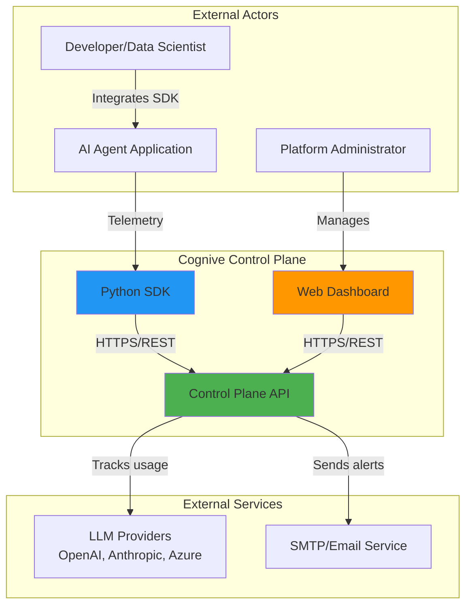
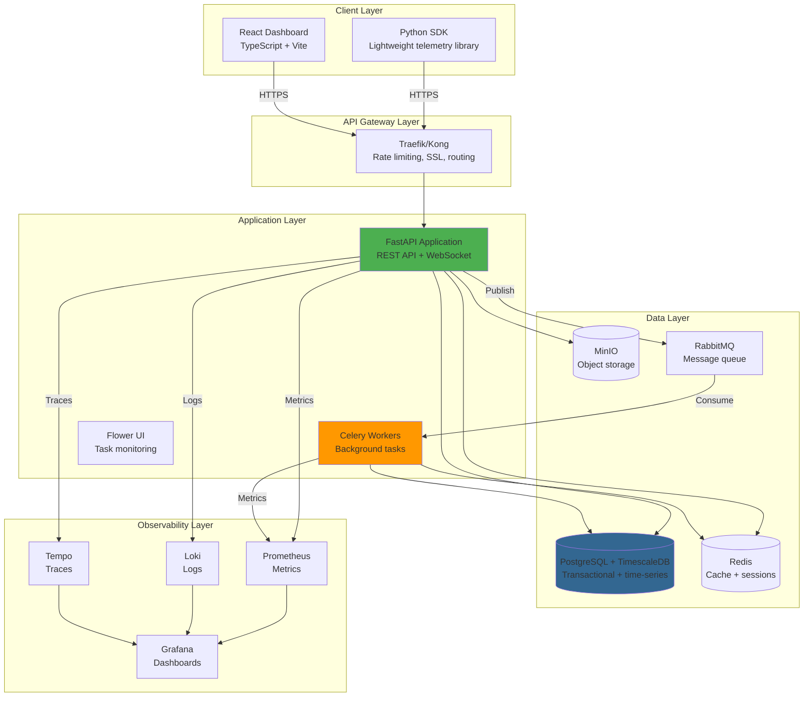
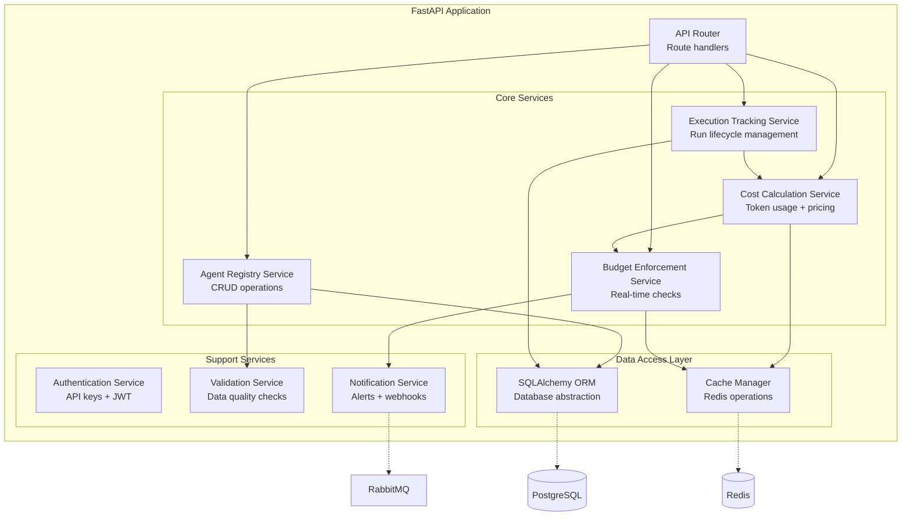
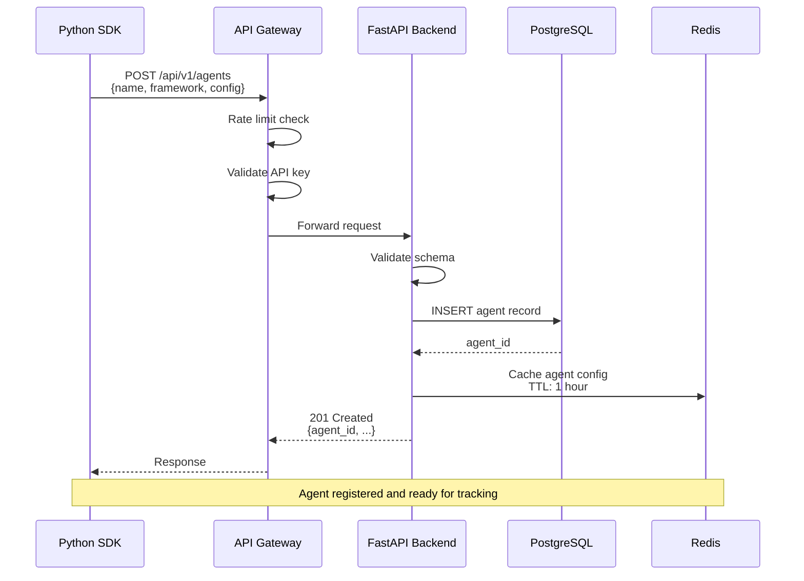
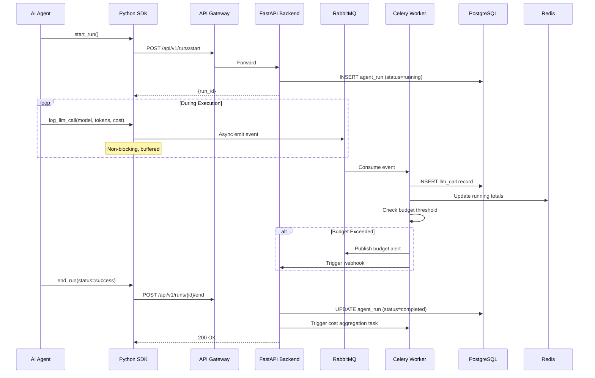
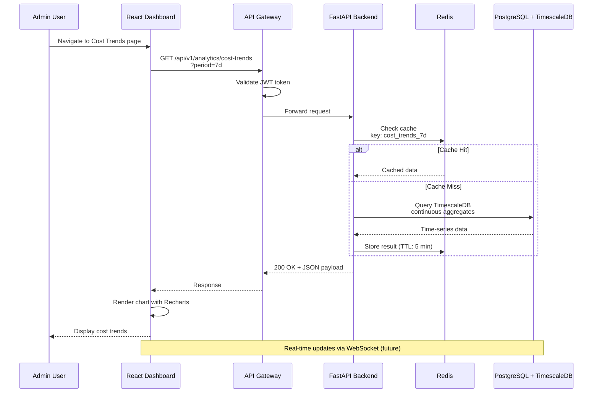
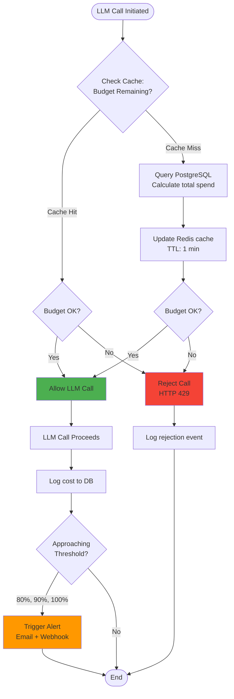

# Cognive Control Plane Architecture

**Version:** 1.0  
**Date:** December 26, 2024  
**Status:** Design Document  
**Epic:** SCRUM-113 (Foundation & Architecture)  
**Story:** SCRUM-33 (Design and document control plane architecture)

---

## Table of Contents

1. [Executive Summary](#executive-summary)
2. [System Architecture Overview](#system-architecture-overview)
3. [Architecture Diagrams](#architecture-diagrams)
4. [Data Flow Diagrams](#data-flow-diagrams)
5. [Deployment Architecture](#deployment-architecture)
6. [Scalability Plan for 1000+ Agents](#scalability-plan-for-1000-agents)
7. [Disaster Recovery Plan](#disaster-recovery-plan)
8. [99.9% Uptime Strategy](#999-uptime-strategy)
9. [Cost Analysis: Free Stack vs AWS](#cost-analysis-free-stack-vs-aws)
10. [Technology Component Details](#technology-component-details)
11. [Security Architecture](#security-architecture)
12. [Appendix](#appendix)

---

## Executive Summary

The Cognive Control Plane is an enterprise-grade platform for managing, governing, and operating autonomous AI agents. This architecture document outlines a **production-ready, free/open-source technology stack** designed to:

- **Minimize Infrastructure Costs**: Save ~$876-1,356/month compared to AWS managed services
- **Ensure Scalability**: Support 1,000+ agents with horizontal scaling capability
- **Guarantee High Availability**: Achieve 99.9% uptime through redundancy and fault tolerance
- **Enable Self-Hosting**: Deploy on VPS ($40-50/mo) or Oracle Cloud Always Free ($0/mo)
- **Provide Migration Path**: All components have documented AWS/cloud alternatives

### Key Architectural Principles

1. **Cloud-Native Design**: Containerized microservices, orchestrated by Kubernetes
2. **Event-Driven Architecture**: Asynchronous processing for scalability
3. **Data Sovereignty**: Self-hosted components for data control
4. **Observability First**: Comprehensive monitoring, logging, and tracing
5. **Security by Design**: Zero-trust architecture with encryption and RBAC

---

## System Architecture Overview

### High-Level Architecture

The Cognive Control Plane consists of five primary layers:

```
┌────────────────────────────────────────────────────────────────┐
│                        CLIENT LAYER                            │
│  • Python SDK (embedded in agent applications)                 │
│  • React Dashboard (web-based management console)              │
└────────────────────────────────────────────────────────────────┘
                              ↓
┌────────────────────────────────────────────────────────────────┐
│                     API GATEWAY LAYER                          │
│  • Traefik / Kong OSS                                          │
│  • Rate limiting • SSL termination • Load balancing            │
└────────────────────────────────────────────────────────────────┘
                              ↓
┌────────────────────────────────────────────────────────────────┐
│                   APPLICATION LAYER                            │
│  • FastAPI REST API (agent registry, tracking, cost mgmt)      │
│  • Celery Workers (background tasks, aggregations)             │
│  • Flower (task monitoring UI)                                 │
└────────────────────────────────────────────────────────────────┘
                              ↓
┌────────────────────────────────────────────────────────────────┐
│                      DATA LAYER                                │
│  • PostgreSQL 15+ (primary database + TimescaleDB extension)   │
│  • Redis 7 (caching, session management, rate limiting)        │
│  • MinIO (S3-compatible object storage for logs/artifacts)     │
│  • RabbitMQ (message queue for async events)                   │
└────────────────────────────────────────────────────────────────┘
                              ↓
┌────────────────────────────────────────────────────────────────┐
│                  OBSERVABILITY LAYER                           │
│  • Prometheus (metrics collection)                             │
│  • Grafana (visualization dashboards)                          │
│  • Loki (centralized logging)                                  │
│  • Tempo (distributed tracing)                                 │
│  • GlitchTip (error tracking)                                  │
│  • Uptime Kuma (uptime monitoring)                             │
│  • Alertmanager (alert routing)                                │
└────────────────────────────────────────────────────────────────┘
```

### Core Components

| Component | Technology | Purpose | Replicas (HA) |
|-----------|-----------|---------|---------------|
| **API Gateway** | Traefik / Kong OSS | Request routing, rate limiting, SSL | 2+ |
| **Backend API** | FastAPI + Uvicorn | REST API, business logic | 3-5 |
| **Background Workers** | Celery + RabbitMQ | Async tasks, aggregations | 2-3 |
| **Primary Database** | PostgreSQL 15+ | ACID transactions, agent data | 1 primary + 2 replicas |
| **Time-Series DB** | TimescaleDB | LLM metrics, cost tracking | Extension on PostgreSQL |
| **Cache** | Redis 7 | Session, rate limits, pricing cache | 1 primary + 1 replica |
| **Object Storage** | MinIO | Logs, artifacts, backups | 1 instance (3+ disks) |
| **Message Queue** | RabbitMQ | Event processing, task queue | 3 node cluster |

---

## Architecture Diagrams

### 1. System Context Diagram



### 2. Container Diagram (C4 Model - Level 2)



### 3. Component Diagram - Backend API Services



---

## Data Flow Diagrams

### 1. Agent Registration Flow



### 2. Agent Execution Tracking Flow



### 3. Dashboard Data Retrieval Flow



### 4. Budget Enforcement Flow



---

## Deployment Architecture

### 1. Self-Hosted Deployment (VPS)

**Target Environment**: Single VPS or dedicated server

#### Architecture

```
┌─────────────────────────────────────────────────────────────┐
│                    VPS Server (8GB RAM, 4 vCPU)             │
│                                                             │
│  ┌──────────────────────────────────────────────────────┐  │
│  │          MicroK8s / k3s (Lightweight K8s)            │  │
│  │                                                      │  │
│  │  ┌────────────┐  ┌────────────┐  ┌──────────────┐  │  │
│  │  │  Traefik   │  │  FastAPI   │  │   Celery     │  │  │
│  │  │  Gateway   │  │   Pods     │  │   Workers    │  │  │
│  │  │   (2)      │  │   (3)      │  │    (2)       │  │  │
│  │  └────────────┘  └────────────┘  └──────────────┘  │  │
│  │                                                      │  │
│  │  ┌────────────┐  ┌────────────┐  ┌──────────────┐  │  │
│  │  │ PostgreSQL │  │   Redis    │  │   RabbitMQ   │  │  │
│  │  │    Pod     │  │    Pod     │  │     Pod      │  │  │
│  │  └────────────┘  └────────────┘  └──────────────┘  │  │
│  │                                                      │  │
│  │  ┌────────────┐  ┌────────────┐  ┌──────────────┐  │  │
│  │  │ Prometheus │  │  Grafana   │  │     Loki     │  │  │
│  │  │    Pod     │  │    Pod     │  │     Pod      │  │  │
│  │  └────────────┘  └────────────┘  └──────────────┘  │  │
│  └──────────────────────────────────────────────────────┘  │
│                                                             │
│  Persistent Storage: 160GB SSD (PersistentVolumes)         │
└─────────────────────────────────────────────────────────────┘
                              ↓
                    Internet (Let's Encrypt SSL)
```

#### Resource Allocation

| Component | CPU Request | CPU Limit | Memory Request | Memory Limit |
|-----------|-------------|-----------|----------------|--------------|
| Traefik (×2) | 100m | 200m | 64Mi | 128Mi |
| FastAPI (×3) | 250m | 500m | 256Mi | 512Mi |
| Celery (×2) | 200m | 400m | 256Mi | 512Mi |
| PostgreSQL | 500m | 1000m | 1Gi | 2Gi |
| Redis | 100m | 200m | 256Mi | 512Mi |
| RabbitMQ | 200m | 400m | 512Mi | 1Gi |
| Prometheus | 200m | 400m | 512Mi | 1Gi |
| Grafana | 100m | 200m | 256Mi | 512Mi |
| Loki | 200m | 400m | 512Mi | 1Gi |
| **Total** | **~2.4 cores** | **~4.8 cores** | **~4.5GB** | **~9GB** |

**Recommended VPS Specs**:
- **CPU**: 4 vCPU (Intel/AMD x86_64)
- **RAM**: 8GB
- **Storage**: 160GB SSD
- **Network**: 100 Mbps+
- **Provider**: Hetzner, DigitalOcean, Linode
- **Cost**: $40-50/month

---

### 2. Oracle Cloud Always Free Tier Deployment

**Cost**: $0/month (forever free)

#### Available Resources

```yaml
Compute:
  - 4 ARM-based Ampere A1 cores (3,000 OCPU hours/month)
  - 24GB RAM
  - Enough for entire Cognive stack!

Storage:
  - 200GB block storage (persistent volumes)
  - 10GB object storage (MinIO)

Networking:
  - 10TB outbound data transfer/month
  - Public IP address
  - Load balancer (1 instance)

Additional:
  - Autonomous Database (ATP/ADW) - 2 instances
  - Option: Use instead of self-hosted PostgreSQL
```

#### Architecture

```
┌─────────────────────────────────────────────────────────────┐
│           Oracle Cloud Always Free Tier                     │
│                                                             │
│  ┌──────────────────────────────────────────────────────┐  │
│  │     Compute Instance (ARM64, 4 cores, 24GB RAM)     │  │
│  │                                                      │  │
│  │  ┌─────────────────────────────────────────────┐   │  │
│  │  │         MicroK8s (ARM64 build)              │   │  │
│  │  │                                             │   │  │
│  │  │  [All Cognive components running]          │   │  │
│  │  │  - Traefik, FastAPI, Celery                │   │  │
│  │  │  - PostgreSQL, Redis, RabbitMQ             │   │  │
│  │  │  - Prometheus, Grafana, Loki               │   │  │
│  │  └─────────────────────────────────────────────┘   │  │
│  └──────────────────────────────────────────────────────┘  │
│                                                             │
│  Block Storage (200GB) → PersistentVolumes                  │
│  Object Storage (10GB) → Optional MinIO backend             │
│                                                             │
│  Oracle Load Balancer (Free) → Traefik Ingress             │
└─────────────────────────────────────────────────────────────┘
```

**Setup Steps**:
1. Create ARM64 instance (Ubuntu 22.04 ARM)
2. Install MicroK8s: `snap install microk8s --classic`
3. Deploy Cognive using ARM64-compatible container images
4. Configure Oracle Load Balancer to point to MicroK8s ingress

---

### 3. AWS Hybrid Deployment (Optional)

**For teams preferring managed services at scale**

#### Architecture

```
┌─────────────────────────────────────────────────────────────┐
│                         AWS Cloud                           │
│                                                             │
│  ┌──────────────────────────────────────────────────────┐  │
│  │  VPC (10.0.0.0/16)                                   │  │
│  │                                                      │  │
│  │  ┌─────────────────┐      ┌─────────────────┐      │  │
│  │  │  Public Subnet  │      │  Private Subnet │      │  │
│  │  │                 │      │                 │      │  │
│  │  │  ALB/NLB        │─────▶│  EKS Cluster    │      │  │
│  │  │  (API Gateway)  │      │                 │      │  │
│  │  │                 │      │  - FastAPI Pods │      │  │
│  │  │                 │      │  - Celery Pods  │      │  │
│  │  └─────────────────┘      └─────────────────┘      │  │
│  │                                  │                  │  │
│  │                                  ↓                  │  │
│  │  ┌─────────────────────────────────────────────┐   │  │
│  │  │         Data Subnet (Private)               │   │  │
│  │  │                                             │   │  │
│  │  │  ┌──────────┐  ┌──────────┐  ┌──────────┐  │   │  │
│  │  │  │ RDS      │  │ElastiCache│ │  MSK     │  │   │  │
│  │  │  │PostgreSQL│  │  Redis    │ │ (Kafka)  │  │   │  │
│  │  │  └──────────┘  └──────────┘  └──────────┘  │   │  │
│  │  └─────────────────────────────────────────────┘   │  │
│  └──────────────────────────────────────────────────────┘  │
│                                                             │
│  Additional Services:                                       │
│  - S3: Object storage                                       │
│  - CloudWatch: Logging & basic monitoring                   │
│  - Secrets Manager: Credentials management                  │
│  - Route53: DNS management                                  │
└─────────────────────────────────────────────────────────────┘
```

#### Cost Estimate (Dev Environment)

| Component | Specification | Monthly Cost |
|-----------|--------------|--------------|
| **EKS Cluster** | 1 cluster control plane | $73 |
| **EC2 Worker Nodes** | 2 × t3.medium (2 vCPU, 4GB) | $60 |
| **RDS PostgreSQL** | db.t3.small (2 vCPU, 2GB), Multi-AZ | $60 |
| **ElastiCache Redis** | cache.t3.micro (0.5GB) | $15 |
| **S3** | 100GB storage + requests | $5 |
| **CloudWatch** | Logs + metrics | $30 |
| **Data Transfer** | Moderate outbound | $20 |
| **Secrets Manager** | 10 secrets | $5 |
| **Load Balancer** | ALB (Application Load Balancer) | $20 |
| **Route53** | Hosted zone + queries | $2 |
| **Total** | | **~$290/month** |

---

## Scalability Plan for 1000+ Agents

### Scalability Requirements

| Metric | Target @ 1K Agents | Target @ 10K Agents |
|--------|-------------------|---------------------|
| **Concurrent Runs** | 500-1,000 | 5,000-10,000 |
| **API Requests/sec** | 2,000 | 20,000 |
| **LLM Calls/sec** | 1,000 | 10,000 |
| **Database Writes/sec** | 500 | 5,000 |
| **Event Processing Lag** | < 5 seconds | < 10 seconds |
| **Storage Growth** | 50GB/month | 500GB/month |

---

### Horizontal Scaling Strategy

#### 1. Application Layer Scaling

**Auto-Scaling Configuration**:

```yaml
apiVersion: autoscaling/v2
kind: HorizontalPodAutoscaler
metadata:
  name: fastapi-api-hpa
spec:
  scaleTargetRef:
    apiVersion: apps/v1
    kind: Deployment
    name: fastapi-api
  minReplicas: 3
  maxReplicas: 20
  metrics:
  - type: Resource
    resource:
      name: cpu
      target:
        type: Utilization
        averageUtilization: 70
  - type: Resource
    resource:
      name: memory
      target:
        type: Utilization
        averageUtilization: 80
  behavior:
    scaleUp:
      stabilizationWindowSeconds: 60
      policies:
      - type: Percent
        value: 50
        periodSeconds: 60
    scaleDown:
      stabilizationWindowSeconds: 300
      policies:
      - type: Percent
        value: 10
        periodSeconds: 60
```

**Scaling Triggers**:
- CPU utilization > 70%
- Memory utilization > 80%
- Custom metrics: requests/sec, error rate

---

#### 2. Database Layer Scaling

**PostgreSQL Scaling Strategy**:

```
┌─────────────────────────────────────────────────────────┐
│              PostgreSQL Cluster                         │
│                                                         │
│  ┌──────────────┐                                      │
│  │   Primary    │ ◄──── Writes (via connection pool)   │
│  │  (Leader)    │                                      │
│  └──────────────┘                                      │
│         │                                               │
│         │ Streaming Replication                        │
│         ↓                                               │
│  ┌──────────────┐  ┌──────────────┐  ┌──────────────┐ │
│  │   Replica 1  │  │   Replica 2  │  │   Replica 3  │ │
│  │   (Sync)     │  │   (Async)    │  │   (Async)    │ │
│  └──────────────┘  └──────────────┘  └──────────────┘ │
│         ↑                 ↑                 ↑          │
│         └─────────────────┴─────────────────┘          │
│                Reads (load balanced)                   │
└─────────────────────────────────────────────────────────┘
```

**Read/Write Splitting**:
- **Writes**: Route to primary via PgBouncer connection pool
- **Reads**: Load balance across replicas (read-only queries)
- **Analytics**: Dedicated replica for heavy queries

**Partitioning Strategy** (for time-series tables):

```sql
-- Partition agent_runs by month
CREATE TABLE agent_runs (
    run_id UUID PRIMARY KEY,
    agent_id UUID NOT NULL,
    start_time TIMESTAMP NOT NULL,
    end_time TIMESTAMP,
    status VARCHAR(20),
    -- ... other columns
) PARTITION BY RANGE (start_time);

-- Create monthly partitions
CREATE TABLE agent_runs_2024_12 PARTITION OF agent_runs
    FOR VALUES FROM ('2024-12-01') TO ('2025-01-01');

CREATE TABLE agent_runs_2025_01 PARTITION OF agent_runs
    FOR VALUES FROM ('2025-01-01') TO ('2025-02-01');
-- ... etc
```

**Index Strategy**:

```sql
-- Critical indexes for performance
CREATE INDEX idx_agent_runs_agent_id ON agent_runs(agent_id);
CREATE INDEX idx_agent_runs_start_time ON agent_runs(start_time DESC);
CREATE INDEX idx_llm_calls_run_id ON llm_calls(run_id);
CREATE INDEX idx_llm_calls_timestamp ON llm_calls(timestamp DESC);
CREATE INDEX idx_agents_team ON agents(team_id);
```

---

#### 3. Cache Layer Scaling (Redis)

**Redis Cluster Configuration** (for 10K+ agents):

```
┌──────────────────────────────────────────────────┐
│              Redis Cluster                       │
│                                                  │
│  ┌─────────┐  ┌─────────┐  ┌─────────┐         │
│  │ Master1 │  │ Master2 │  │ Master3 │         │
│  │ (0-5461)│  │(5462-    │  │(10923-  │         │
│  │         │  │ 10922)  │  │ 16383)  │         │
│  └────┬────┘  └────┬────┘  └────┬────┘         │
│       │            │            │               │
│  ┌────┴────┐  ┌────┴────┐  ┌────┴────┐         │
│  │ Replica1│  │ Replica2│  │ Replica3│         │
│  └─────────┘  └─────────┘  └─────────┘         │
│                                                  │
│  Hash slot sharding (16384 slots)               │
│  Automatic failover                              │
└──────────────────────────────────────────────────┘
```

**Caching Strategy**:

| Data Type | Cache Key Pattern | TTL | Eviction Policy |
|-----------|------------------|-----|-----------------|
| Agent config | `agent:{agent_id}:config` | 1 hour | LRU |
| LLM pricing | `pricing:{provider}:{model}` | 1 hour | No eviction |
| Budget totals | `budget:{agent_id}:spent:{date}` | 1 minute | LRU |
| Session data | `session:{session_id}` | 30 minutes | TTL |
| Rate limits | `ratelimit:{api_key}:{minute}` | 1 minute | TTL |

---

#### 4. Message Queue Scaling (RabbitMQ)

**RabbitMQ Cluster** (3-node quorum):

```
┌──────────────────────────────────────────────────┐
│          RabbitMQ Cluster (Quorum Queues)        │
│                                                  │
│  ┌─────────┐  ┌─────────┐  ┌─────────┐         │
│  │  Node 1 │◄─┤  Node 2 │─►│  Node 3 │         │
│  │(Leader) │  │(Follower)│  │(Follower)│        │
│  └─────────┘  └─────────┘  └─────────┘         │
│       │            │            │               │
│       └────────────┴────────────┘               │
│         Replication (quorum)                     │
│                                                  │
│  Queues:                                         │
│  - agent.events (durable, quorum)               │
│  - cost.calculations (durable, quorum)           │
│  - budget.alerts (durable, quorum)               │
└──────────────────────────────────────────────────┘
```

**Queue Configuration**:

```python
# Declare quorum queue with high availability
channel.queue_declare(
    queue='agent.events',
    durable=True,
    arguments={
        'x-queue-type': 'quorum',
        'x-max-length': 100000,  # Limit queue size
        'x-overflow': 'reject-publish',  # Reject when full
        'x-delivery-limit': 3  # Dead letter after 3 failures
    }
)
```

---

### Vertical Scaling Guidelines

| Load Level | Server Specs | Est. Cost (VPS) |
|-----------|--------------|-----------------|
| **100 agents** | 4 vCPU, 8GB RAM, 100GB | $40-50/mo |
| **500 agents** | 8 vCPU, 16GB RAM, 200GB | $80-100/mo |
| **1,000 agents** | 16 vCPU, 32GB RAM, 500GB | $160-200/mo |
| **5,000 agents** | Multi-server cluster | $500-800/mo |
| **10,000+ agents** | AWS EKS + managed services | $2,000-5,000/mo |

---

### Performance Optimization Strategies

#### 1. Database Optimization

```sql
-- Enable query plan caching
ALTER SYSTEM SET shared_preload_libraries = 'pg_stat_statements';

-- Configure connection pooling
ALTER SYSTEM SET max_connections = 200;
ALTER SYSTEM SET shared_buffers = '4GB';
ALTER SYSTEM SET effective_cache_size = '12GB';
ALTER SYSTEM SET work_mem = '16MB';
ALTER SYSTEM SET maintenance_work_mem = '512MB';

-- Enable autovacuum tuning
ALTER SYSTEM SET autovacuum_max_workers = 4;
ALTER SYSTEM SET autovacuum_naptime = '30s';
```

#### 2. API Response Caching

```python
# FastAPI with Redis caching
from fastapi_cache import FastAPICache
from fastapi_cache.backends.redis import RedisBackend
from fastapi_cache.decorator import cache

@app.get("/api/v1/agents/{agent_id}")
@cache(expire=3600)  # Cache for 1 hour
async def get_agent(agent_id: str):
    return await agent_service.get_agent(agent_id)
```

#### 3. Celery Task Optimization

```python
# Batch processing for efficiency
@celery_app.task
def aggregate_costs_batch(run_ids: List[str]):
    """Process multiple runs in a single task"""
    with db.begin():
        for run_id in run_ids:
            calculate_run_cost(run_id)
    
# Schedule batched tasks
@celery_app.task
def trigger_cost_aggregation():
    pending_runs = get_pending_run_ids(limit=100)
    aggregate_costs_batch.delay(pending_runs)
```

---

## Disaster Recovery Plan

### Backup Strategy

#### 1. Database Backups

**Continuous WAL Archiving**:

```bash
# PostgreSQL configuration (postgresql.conf)
wal_level = replica
archive_mode = on
archive_command = 'pgbackrest --stanza=cognive archive-push %p'
```

**Backup Schedule**:

| Backup Type | Frequency | Retention | Storage Location |
|-------------|-----------|-----------|------------------|
| **Full Backup** | Daily @ 2 AM UTC | 30 days | MinIO + offsite |
| **Incremental** | Every 6 hours | 7 days | MinIO |
| **WAL Archives** | Continuous | 30 days | MinIO + offsite |
| **Snapshots** | Weekly | 12 weeks | Block storage |

**Automated Backup Script**:

```bash
#!/bin/bash
# daily_backup.sh

BACKUP_DATE=$(date +%Y%m%d)
BACKUP_DIR="/backups/postgres"
S3_BUCKET="s3://cognive-backups-offsite"

# Full database dump
pg_dump -Fc cognive > "$BACKUP_DIR/cognive_full_$BACKUP_DATE.dump"

# Upload to MinIO
mc cp "$BACKUP_DIR/cognive_full_$BACKUP_DATE.dump" minio/backups/

# Upload to offsite (S3 Glacier or similar)
aws s3 cp "$BACKUP_DIR/cognive_full_$BACKUP_DATE.dump" \
    "$S3_BUCKET/" --storage-class GLACIER

# Cleanup old backups (keep 30 days)
find "$BACKUP_DIR" -type f -mtime +30 -delete

# Verify backup integrity
pg_restore --list "$BACKUP_DIR/cognive_full_$BACKUP_DATE.dump" > /dev/null
if [ $? -eq 0 ]; then
    echo "Backup verified successfully"
else
    echo "ERROR: Backup verification failed!" | mail -s "Backup Alert" admin@example.com
fi
```

---

#### 2. Configuration Backups

**Kubernetes Resources**:

```bash
# Backup all Kubernetes resources
kubectl get all --all-namespaces -o yaml > k8s_backup_$(date +%Y%m%d).yaml

# Backup ConfigMaps and Secrets (encrypted)
kubectl get configmaps,secrets --all-namespaces -o yaml | \
    sops --encrypt --output secrets_backup_$(date +%Y%m%d).yaml
```

**Infrastructure as Code**:
- Git repository with Terraform state backed up to S3/MinIO
- Version controlled with tags for each deployment

---

### Recovery Procedures

#### RTO/RPO Targets

| Component | RTO (Recovery Time Objective) | RPO (Recovery Point Objective) |
|-----------|-------------------------------|-------------------------------|
| **API Service** | < 15 minutes | 0 (stateless) |
| **Database** | < 1 hour | < 15 minutes (WAL) |
| **Cache (Redis)** | < 5 minutes | 0 (ephemeral) |
| **Object Storage** | < 30 minutes | < 1 hour |
| **Message Queue** | < 10 minutes | < 5 minutes |

---

#### Disaster Recovery Scenarios

##### Scenario 1: Single Pod Failure

**Detection**: Kubernetes liveness probe fails

**Automatic Recovery**:
```yaml
livenessProbe:
  httpGet:
    path: /health
    port: 8000
  initialDelaySeconds: 30
  periodSeconds: 10
  failureThreshold: 3
```

Kubernetes automatically restarts the pod. No manual intervention needed.

---

##### Scenario 2: Database Corruption

**Detection**: Database health check fails, data inconsistency detected

**Recovery Steps**:

```bash
# 1. Stop application pods to prevent writes
kubectl scale deployment fastapi-api --replicas=0

# 2. Identify last good backup
ls -lh /backups/postgres/*.dump

# 3. Restore from backup
pg_restore -C -d postgres cognive_full_20241225.dump

# 4. Apply WAL archives to recover to point-in-time
pgbackrest --stanza=cognive --type=time \
    --target="2024-12-26 10:30:00" restore

# 5. Verify data integrity
psql -d cognive -c "SELECT COUNT(*) FROM agents;"
psql -d cognive -c "SELECT COUNT(*) FROM agent_runs;"

# 6. Restart application
kubectl scale deployment fastapi-api --replicas=3

# 7. Monitor for errors
kubectl logs -f deployment/fastapi-api
```

**Expected Recovery Time**: 45-60 minutes

---

##### Scenario 3: Complete Datacenter Failure

**Detection**: All services unreachable, infrastructure alerts triggered

**Recovery Steps** (Disaster Recovery Site):

```bash
# 1. Provision new infrastructure (Terraform)
cd terraform/environments/dr
terraform init
terraform apply -auto-approve

# 2. Restore database from offsite backup
aws s3 cp s3://cognive-backups-offsite/cognive_full_20241225.dump /tmp/
pg_restore -C -d postgres /tmp/cognive_full_20241225.dump

# 3. Deploy application via GitOps
kubectl apply -f k8s/manifests/

# 4. Update DNS to point to DR site
# (Manual step or automated with Route53 health checks)

# 5. Verify application functionality
curl https://api-dr.cognive.io/health

# 6. Notify stakeholders
echo "DR site activated" | mail -s "DR Activated" team@example.com
```

**Expected Recovery Time**: 2-4 hours (depending on backup size)

---

### Data Replication Strategy

#### Geographic Replication (Optional for Enterprise)

```
┌─────────────────────────────────────────────────────────┐
│                  Primary Region (US East)               │
│                                                         │
│  PostgreSQL Primary → Streaming Replication            │
│                           │                             │
│                           ↓                             │
└───────────────────────────┼─────────────────────────────┘
                            │
                            │ (Async Replication)
                            ↓
┌─────────────────────────────────────────────────────────┐
│              Secondary Region (US West) - Standby       │
│                                                         │
│  PostgreSQL Replica (Read-Only)                         │
│  - Can be promoted to primary in DR scenario            │
│  - Serves read queries for analytics                    │
└─────────────────────────────────────────────────────────┘
```

**Configuration** (PostgreSQL Streaming Replication):

```bash
# Primary server (postgresql.conf)
wal_level = replica
max_wal_senders = 10
wal_keep_size = 1GB

# Replica server (recovery.conf)
standby_mode = on
primary_conninfo = 'host=primary-db.example.com port=5432 user=replicator password=xxx'
restore_command = 'pgbackrest --stanza=cognive archive-get %f "%p"'
```

---

## 99.9% Uptime Strategy

**Target**: 99.9% uptime = **< 43.8 minutes downtime per month**

### High Availability Architecture

#### Component Redundancy Matrix

| Component | Instances | Load Balancing | Failover Time | SPOF? |
|-----------|-----------|----------------|---------------|-------|
| **API Gateway** | 2+ | Round-robin | < 1 sec | ❌ No |
| **FastAPI Backend** | 3+ | Round-robin | < 1 sec | ❌ No |
| **Celery Workers** | 2+ | Task queue | Automatic | ❌ No |
| **PostgreSQL** | 1 + 2 replicas | Read/write split | 30-60 sec | ⚠️ Minimal |
| **Redis** | 1 + 1 replica | Sentinel failover | < 10 sec | ⚠️ Minimal |
| **RabbitMQ** | 3-node cluster | Quorum queues | < 5 sec | ❌ No |
| **MinIO** | 1 instance | (Data redundant) | N/A | ⚠️ Minimal |

---

### High Availability Configurations

#### 1. PostgreSQL High Availability (Patroni)

**Patroni Configuration** (automatic failover):

```yaml
# patroni.yml
scope: cognive-db
name: postgres-1

restapi:
  listen: 0.0.0.0:8008
  connect_address: postgres-1:8008

etcd:
  hosts: etcd-1:2379,etcd-2:2379,etcd-3:2379

bootstrap:
  dcs:
    ttl: 30
    loop_wait: 10
    retry_timeout: 10
    maximum_lag_on_failover: 1048576
    postgresql:
      use_pg_rewind: true
      parameters:
        max_connections: 200
        shared_buffers: 4GB

postgresql:
  listen: 0.0.0.0:5432
  connect_address: postgres-1:5432
  data_dir: /var/lib/postgresql/15/main
  authentication:
    replication:
      username: replicator
      password: xxx
    superuser:
      username: postgres
      password: xxx
```

**Failover Behavior**:
- Patroni monitors PostgreSQL health via etcd
- Automatic promotion of replica to primary if primary fails
- Typical failover time: **30-60 seconds**
- Application reconnects automatically via connection pool

---

#### 2. Redis High Availability (Sentinel)

**Redis Sentinel Configuration**:

```bash
# sentinel.conf
port 26379
sentinel monitor cognive-redis redis-master 6379 2
sentinel down-after-milliseconds cognive-redis 5000
sentinel parallel-syncs cognive-redis 1
sentinel failover-timeout cognive-redis 10000
```

**Application Configuration** (Python):

```python
from redis.sentinel import Sentinel

sentinel = Sentinel([
    ('sentinel-1', 26379),
    ('sentinel-2', 26379),
    ('sentinel-3', 26379)
], socket_timeout=0.1)

# Get master connection (automatically fails over)
master = sentinel.master_for('cognive-redis', socket_timeout=0.1)
master.set('key', 'value')

# Get replica connection (for reads)
replica = sentinel.slave_for('cognive-redis', socket_timeout=0.1)
value = replica.get('key')
```

**Failover Behavior**:
- Sentinel detects master failure (down-after-milliseconds: 5s)
- Quorum vote to promote replica to master (2 out of 3 sentinels)
- Typical failover time: **< 10 seconds**

---

### Health Checks & Monitoring

#### 1. Kubernetes Health Probes

**FastAPI Deployment with Health Checks**:

```yaml
apiVersion: apps/v1
kind: Deployment
metadata:
  name: fastapi-api
spec:
  replicas: 3
  template:
    spec:
      containers:
      - name: api
        image: cognive-api:latest
        ports:
        - containerPort: 8000
        livenessProbe:
          httpGet:
            path: /health/liveness
            port: 8000
          initialDelaySeconds: 30
          periodSeconds: 10
          timeoutSeconds: 5
          failureThreshold: 3
        readinessProbe:
          httpGet:
            path: /health/readiness
            port: 8000
          initialDelaySeconds: 10
          periodSeconds: 5
          timeoutSeconds: 3
          failureThreshold: 2
        resources:
          requests:
            memory: "256Mi"
            cpu: "250m"
          limits:
            memory: "512Mi"
            cpu: "500m"
```

**Health Check Endpoints**:

```python
# app/routers/health.py
@app.get("/health/liveness")
async def liveness():
    """Simple liveness check - is the app running?"""
    return {"status": "alive", "timestamp": datetime.utcnow()}

@app.get("/health/readiness")
async def readiness(db: Session = Depends(get_db)):
    """Readiness check - can the app serve traffic?"""
    try:
        # Check database connectivity
        db.execute(text("SELECT 1"))
        
        # Check Redis connectivity
        redis_client.ping()
        
        return {
            "status": "ready",
            "checks": {
                "database": "ok",
                "cache": "ok"
            }
        }
    except Exception as e:
        raise HTTPException(status_code=503, detail=f"Not ready: {str(e)}")
```

---

#### 2. Uptime Monitoring (Uptime Kuma)

**Configuration**:

```yaml
# Uptime Kuma monitors (self-hosted)
monitors:
  - name: "API Health Check"
    type: HTTP
    url: https://api.cognive.io/health/readiness
    interval: 60  # seconds
    retries: 3
    
  - name: "Dashboard Availability"
    type: HTTP
    url: https://dashboard.cognive.io
    interval: 60
    retries: 3
    
  - name: "Database Connectivity"
    type: PostgreSQL
    host: postgres.cognive.internal
    port: 5432
    database: cognive
    interval: 120
    
  - name: "Redis Connectivity"
    type: Redis
    host: redis.cognive.internal
    port: 6379
    interval: 120

notifications:
  - type: email
    to: ops-team@example.com
  - type: slack
    webhook: https://hooks.slack.com/services/xxx
```

---

### Alerting Strategy

**Critical Alerts** (PagerDuty / Opsgenie):

```yaml
# Prometheus alerting rules
groups:
- name: critical_alerts
  interval: 30s
  rules:
  
  # Service availability
  - alert: ServiceDown
    expr: up{job="fastapi-api"} == 0
    for: 2m
    labels:
      severity: critical
    annotations:
      summary: "Service {{ $labels.instance }} is down"
      description: "Service has been down for more than 2 minutes"
  
  # High error rate
  - alert: HighErrorRate
    expr: rate(http_requests_total{status=~"5.."}[5m]) > 0.05
    for: 5m
    labels:
      severity: critical
    annotations:
      summary: "High error rate detected"
      description: "Error rate is {{ $value }} requests/sec"
  
  # Database issues
  - alert: DatabaseConnectionPool95Percent
    expr: pg_stat_database_numbackends / pg_settings_max_connections > 0.95
    for: 5m
    labels:
      severity: critical
    annotations:
      summary: "Database connection pool nearly exhausted"
  
  # Disk space
  - alert: DiskSpaceLow
    expr: (node_filesystem_avail_bytes / node_filesystem_size_bytes) < 0.1
    for: 10m
    labels:
      severity: critical
    annotations:
      summary: "Disk space below 10% on {{ $labels.instance }}"
  
  # Memory pressure
  - alert: HighMemoryUsage
    expr: (1 - (node_memory_MemAvailable_bytes / node_memory_MemTotal_bytes)) > 0.9
    for: 10m
    labels:
      severity: warning
    annotations:
      summary: "Memory usage above 90% on {{ $labels.instance }}"
```

---

### Maintenance Windows

**Planned Maintenance**:
- **Schedule**: Every 3rd Sunday @ 2-4 AM UTC
- **Duration**: Up to 2 hours
- **Communication**: 1 week notice via status page
- **Impact**: Minimal (rolling updates preferred)

**Zero-Downtime Deployment Process**:

```bash
#!/bin/bash
# Rolling update script

# 1. Deploy new version to 1 pod
kubectl set image deployment/fastapi-api api=cognive-api:v1.2.0

# 2. Wait for new pod to be ready
kubectl rollout status deployment/fastapi-api

# 3. Monitor for errors (5 min)
sleep 300

# 4. Check error rate
ERROR_RATE=$(curl -s "http://prometheus:9090/api/v1/query?query=rate(http_requests_total{status=~'5..'}[5m])" | jq '.data.result[0].value[1]')

if (( $(echo "$ERROR_RATE < 0.01" | bc -l) )); then
    echo "Error rate acceptable, continuing rollout"
    # Continue rollout to remaining pods
    kubectl rollout resume deployment/fastapi-api
else
    echo "High error rate detected, rolling back"
    kubectl rollout undo deployment/fastapi-api
    exit 1
fi

# 5. Verify all pods updated
kubectl get pods -l app=fastapi-api
```

---

### SLA Commitments

**Service Level Agreement**:

| Metric | Target | Measurement |
|--------|--------|-------------|
| **Uptime** | 99.9% | Monthly (43.8 min downtime allowed) |
| **API Latency (p95)** | < 200ms | Measured by Prometheus |
| **API Latency (p99)** | < 500ms | Measured by Prometheus |
| **Error Rate** | < 0.1% | 5xx errors / total requests |
| **Support Response** | < 4 hours | Business hours (M-F, 9-5 UTC) |

**Exclusions from SLA**:
- Planned maintenance windows (with notice)
- Third-party service outages (LLM providers, DNS)
- Force majeure events
- User-caused issues (invalid API usage)

---

## Cost Analysis: Free Stack vs AWS

### Scenario 1: Startup (100-500 Agents)

#### Free/Open-Source Stack (Self-Hosted VPS)

| Component | Technology | Cost |
|-----------|-----------|------|
| **Server** | Hetzner CPX31 (4 vCPU, 8GB RAM, 160GB) | $40/mo |
| **Domain** | .io domain + Cloudflare DNS | $2/mo |
| **SSL** | Let's Encrypt | $0 |
| **Monitoring** | Prometheus + Grafana (self-hosted) | $0 |
| **Logging** | Loki (self-hosted) | $0 |
| **Backups** | MinIO + offsite S3 Glacier | $5/mo |
| **Email** | AWS SES (62K emails free) | $0 |
| **Total** | | **$47/month** |

---

#### AWS Managed Stack

| Component | Technology | Cost |
|-----------|-----------|------|
| **Compute** | EKS Cluster + 2 × t3.medium nodes | $133/mo |
| **Database** | RDS PostgreSQL (db.t3.small, Multi-AZ) | $60/mo |
| **Cache** | ElastiCache Redis (cache.t3.micro) | $15/mo |
| **Storage** | S3 (50GB) | $2/mo |
| **Load Balancer** | ALB | $20/mo |
| **CloudWatch** | Logs + Metrics | $30/mo |
| **SES** | Email (within free tier) | $0 |
| **Data Transfer** | Outbound data | $15/mo |
| **Total** | | **$275/month** |

**Savings with Free Stack**: **$228/month** ($2,736/year)

---

### Scenario 2: Growth (1,000-5,000 Agents)

#### Free/Open-Source Stack (Upgraded VPS)

| Component | Technology | Cost |
|-----------|-----------|------|
| **Server** | Hetzner CCX33 (16 vCPU, 32GB RAM, 500GB) | $160/mo |
| **Domain + CDN** | Cloudflare Pro (for DDoS protection) | $20/mo |
| **SSL** | Let's Encrypt | $0 |
| **Monitoring** | Prometheus + Grafana (self-hosted) | $0 |
| **Logging** | Loki (self-hosted) | $0 |
| **Backups** | MinIO + offsite S3 Glacier (100GB) | $15/mo |
| **Email** | AWS SES (within free tier) | $0 |
| **Total** | | **$195/month** |

---

#### AWS Managed Stack

| Component | Technology | Cost |
|-----------|-----------|------|
| **Compute** | EKS Cluster + 4 × t3.large nodes | $350/mo |
| **Database** | RDS PostgreSQL (db.r6g.xlarge, Multi-AZ) | $600/mo |
| **Cache** | ElastiCache Redis (cache.r6g.large) | $150/mo |
| **Storage** | S3 (500GB) | $15/mo |
| **Load Balancer** | ALB | $20/mo |
| **CloudWatch** | Logs + Metrics | $100/mo |
| **SES** | Email | $5/mo |
| **Data Transfer** | Outbound data (5TB) | $150/mo |
| **MSK (Kafka)** | Optional for event streaming | $300/mo |
| **Datadog** | APM + Monitoring (5 hosts) | $155/mo |
| **Total** | | **$1,845/month** |

**Savings with Free Stack**: **$1,650/month** ($19,800/year)

---

### Scenario 3: Oracle Cloud Always Free (Any Scale up to Limits)

**Cost**: **$0/month** (forever free)

**What's Included**:
- 4 ARM cores, 24GB RAM (enough for 500-1,000 agents)
- 200GB block storage
- 10TB outbound data transfer
- Public IP + Load Balancer

**Trade-offs**:
- ARM architecture (ensure Docker images support ARM64)
- Limited to single instance (no multi-region)
- Manual management (no managed DB like RDS)

**Best For**:
- Side projects
- MVP/POC
- Cost-conscious startups
- Education/research

---

### 5-Year Total Cost of Ownership (TCO)

| Scenario | Free Stack (VPS) | AWS Managed | Savings |
|----------|------------------|-------------|---------|
| **Startup (500 agents)** | $2,820 (5 years) | $16,500 | **$13,680** |
| **Growth (1K-5K agents)** | $11,700 | $110,700 | **$99,000** |
| **Oracle Free Tier** | $0 | $16,500 | **$16,500** |

---

### Hidden Costs Comparison

| Cost Category | Free Stack | AWS Managed |
|--------------|-----------|-------------|
| **DevOps Time** | Higher (self-managed) | Lower (managed services) |
| **Security Patches** | Manual (via automation) | Automatic (AWS) |
| **Scaling Complexity** | Medium (manual vertical scaling) | Low (auto-scaling) |
| **Vendor Lock-In** | None (portable) | High (AWS-specific) |
| **Learning Curve** | Steeper (Kubernetes, etc.) | Lower (AWS console) |
| **Support** | Community (free) | AWS Support ($100-15K/mo) |

---

### Recommendation by Use Case

| Use Case | Recommended Stack | Rationale |
|----------|------------------|-----------|
| **Bootstrapped Startup** | Oracle Free Tier → VPS | $0-50/mo, full control |
| **Well-Funded Startup** | Free Stack on VPS | $50-200/mo, scalable, portable |
| **Enterprise (< 5K agents)** | Free Stack on VPS | $200-500/mo, cost-effective |
| **Enterprise (> 5K agents)** | Hybrid (Free + AWS for scale) | $500-2K/mo, best of both |
| **Enterprise (> 50K agents)** | AWS Managed Services | $5K-20K/mo, fully managed |

---

## Technology Component Details

### 1. k3s / MicroK8s (Container Orchestration)

**Why k3s/MicroK8s over AWS EKS?**
- **Cost**: Free (vs $73/mo for EKS control plane)
- **Simplicity**: Single binary, easy installation
- **Resource Efficiency**: Runs on 512MB RAM
- **Production-Ready**: Used by major enterprises

**MicroK8s Installation**:

```bash
# Install MicroK8s
sudo snap install microk8s --classic

# Enable required add-ons
microk8s enable dns storage ingress prometheus

# Configure kubectl alias
alias kubectl='microk8s kubectl'

# Verify installation
kubectl get nodes
```

**k3s Installation** (alternative):

```bash
# Install k3s
curl -sfL https://get.k3s.io | sh -

# Verify installation
sudo k3s kubectl get nodes
```

---

### 2. Traefik (API Gateway)

**Why Traefik over Kong/AWS API Gateway?**
- **Native Kubernetes Integration**: Auto-discovery of services
- **Modern Architecture**: Built for cloud-native apps
- **Easy SSL**: Automatic Let's Encrypt integration
- **Performance**: Low latency, high throughput

**Traefik Configuration**:

```yaml
# traefik-values.yaml (Helm chart)
ingressRoute:
  dashboard:
    enabled: true

service:
  type: LoadBalancer

ports:
  web:
    port: 80
    redirectTo: websecure
  websecure:
    port: 443
    tls:
      enabled: true
      certResolver: letsencrypt

certResolvers:
  letsencrypt:
    acme:
      email: admin@example.com
      storage: /data/acme.json
      tlsChallenge: true
```

**Deploy Traefik**:

```bash
helm repo add traefik https://traefik.github.io/charts
helm install traefik traefik/traefik -f traefik-values.yaml
```

---

### 3. FastAPI (Backend Framework)

**Why FastAPI?**
- **High Performance**: Async/await, similar to Node.js/Go
- **Auto Documentation**: OpenAPI/Swagger built-in
- **Type Safety**: Pydantic validation
- **Modern**: Python 3.11+ support

**Project Structure**:

```
backend/
├── app/
│   ├── main.py                 # Application entry point
│   ├── config.py               # Configuration management
│   ├── dependencies.py         # Shared dependencies
│   ├── models/                 # SQLAlchemy models
│   │   ├── agent.py
│   │   ├── run.py
│   │   └── llm_call.py
│   ├── routers/                # API endpoints
│   │   ├── agents.py
│   │   ├── runs.py
│   │   ├── cost.py
│   │   └── health.py
│   ├── services/               # Business logic
│   │   ├── agent_service.py
│   │   ├── cost_service.py
│   │   └── budget_service.py
│   └── schemas/                # Pydantic schemas
│       ├── agent_schemas.py
│       └── run_schemas.py
├── tests/
├── requirements.txt
└── Dockerfile
```

---

### 4. PostgreSQL + TimescaleDB

**Why PostgreSQL + TimescaleDB?**
- **ACID Compliance**: Transactional integrity
- **JSONB**: Flexible metadata storage
- **TimescaleDB**: Optimized time-series queries without separate DB
- **Battle-Tested**: Industry standard

**TimescaleDB Installation**:

```sql
-- Install TimescaleDB extension
CREATE EXTENSION IF NOT EXISTS timescaledb;

-- Convert table to hypertable (for time-series data)
SELECT create_hypertable('llm_calls', 'timestamp');

-- Create continuous aggregate (pre-computed rollups)
CREATE MATERIALIZED VIEW llm_calls_hourly
WITH (timescaledb.continuous) AS
SELECT
  time_bucket('1 hour', timestamp) AS hour,
  agent_id,
  model,
  COUNT(*) AS call_count,
  SUM(input_tokens) AS total_input_tokens,
  SUM(output_tokens) AS total_output_tokens,
  SUM(cost) AS total_cost
FROM llm_calls
GROUP BY hour, agent_id, model;

-- Automatically refresh every hour
SELECT add_continuous_aggregate_policy('llm_calls_hourly',
  start_offset => INTERVAL '3 hours',
  end_offset => INTERVAL '1 hour',
  schedule_interval => INTERVAL '1 hour');
```

---

### 5. Redis (Caching)

**Why Redis?**
- **Speed**: Sub-millisecond latency
- **Versatility**: Cache, session store, rate limiter, pub/sub
- **Persistence**: Optional (AOF/RDB) for critical data
- **Simple**: Easy to operate and scale

**Redis Configuration**:

```conf
# redis.conf
maxmemory 4gb
maxmemory-policy allkeys-lru

# Enable persistence for critical data
appendonly yes
appendfsync everysec

# Replication (for HA)
replicaof redis-master 6379
```

---

### 6. MinIO (Object Storage)

**Why MinIO over AWS S3?**
- **S3-Compatible**: Same API as AWS S3
- **Self-Hosted**: No data egress costs
- **Performance**: High throughput
- **Cost**: Free (storage cost = disk cost)

**MinIO Deployment**:

```bash
# Deploy MinIO on Kubernetes
kubectl apply -f - <<EOF
apiVersion: apps/v1
kind: StatefulSet
metadata:
  name: minio
spec:
  serviceName: minio
  replicas: 1
  selector:
    matchLabels:
      app: minio
  template:
    metadata:
      labels:
        app: minio
    spec:
      containers:
      - name: minio
        image: minio/minio:latest
        args:
        - server
        - /data
        - --console-address
        - ":9001"
        env:
        - name: MINIO_ROOT_USER
          value: "admin"
        - name: MINIO_ROOT_PASSWORD
          valueFrom:
            secretKeyRef:
              name: minio-secret
              key: password
        ports:
        - containerPort: 9000
        - containerPort: 9001
        volumeMounts:
        - name: data
          mountPath: /data
  volumeClaimTemplates:
  - metadata:
      name: data
    spec:
      accessModes: [ "ReadWriteOnce" ]
      resources:
        requests:
          storage: 50Gi
EOF
```

---

### 7. RabbitMQ (Message Queue)

**Why RabbitMQ over AWS SQS?**
- **Feature-Rich**: Routing, exchanges, dead-letter queues
- **Reliable**: Quorum queues with replication
- **Management UI**: Built-in monitoring
- **Cost**: Free (self-hosted)

**RabbitMQ Deployment**:

```bash
# Deploy RabbitMQ cluster with Helm
helm repo add bitnami https://charts.bitnami.com/bitnami
helm install rabbitmq bitnami/rabbitmq \
  --set replicaCount=3 \
  --set auth.username=admin \
  --set auth.password=<secure-password> \
  --set persistence.size=10Gi
```

---

### 8. Prometheus + Grafana (Monitoring)

**Why Prometheus + Grafana?**
- **Industry Standard**: Used by most cloud-native apps
- **Powerful Queries**: PromQL for flexible metrics
- **Beautiful Dashboards**: Grafana's rich visualizations
- **Cost**: Free (self-hosted) vs Datadog ($31/host/mo)

**Key Metrics to Track**:

```yaml
# Custom Prometheus metrics in FastAPI
from prometheus_client import Counter, Histogram, Gauge

# Business metrics
agents_registered_total = Counter('agents_registered_total', 'Total agents', ['framework'])
llm_calls_total = Counter('llm_calls_total', 'LLM calls', ['provider', 'model'])
cost_total_dollars = Counter('cost_total_dollars', 'Total cost', ['provider'])

# System metrics
request_duration = Histogram('request_duration_seconds', 'Request duration', ['endpoint'])
active_runs = Gauge('active_agent_runs', 'Active runs')
```

---

### 9. Grafana Loki (Logging)

**Why Loki over ELK Stack?**
- **Simpler**: No indexing (uses labels like Prometheus)
- **Cost-Effective**: Lower storage requirements
- **Integrated**: Works seamlessly with Grafana
- **Scalable**: Handles high log volumes

**Loki Deployment**:

```bash
# Deploy Loki with Helm
helm repo add grafana https://grafana.github.io/helm-charts
helm install loki grafana/loki-stack \
  --set loki.persistence.enabled=true \
  --set loki.persistence.size=50Gi \
  --set promtail.enabled=true
```

---

## Security Architecture

### Defense in Depth Strategy

```
┌─────────────────────────────────────────────────────────────┐
│                     Layer 1: Network Security               │
│  • Firewall rules (iptables / cloud firewall)               │
│  • DDoS protection (Cloudflare)                             │
│  • VPN for admin access                                     │
└─────────────────────────────────────────────────────────────┘
                              ↓
┌─────────────────────────────────────────────────────────────┐
│                Layer 2: API Gateway Security                │
│  • Rate limiting (per API key)                              │
│  • IP whitelisting (optional)                               │
│  • SSL/TLS termination (TLS 1.3)                            │
│  • Request validation                                       │
└─────────────────────────────────────────────────────────────┘
                              ↓
┌─────────────────────────────────────────────────────────────┐
│             Layer 3: Application Security                   │
│  • API key authentication (SDK)                             │
│  • JWT authentication (Dashboard)                           │
│  • RBAC (Role-Based Access Control)                         │
│  • Input validation (Pydantic)                              │
│  • SQL injection prevention (SQLAlchemy ORM)                │
│  • XSS protection (React)                                   │
└─────────────────────────────────────────────────────────────┘
                              ↓
┌─────────────────────────────────────────────────────────────┐
│                 Layer 4: Data Security                      │
│  • Encryption in transit (TLS 1.3)                          │
│  • Encryption at rest (PostgreSQL TDE)                      │
│  • Field-level encryption (PII data)                        │
│  • Secrets management (Vault / SOPS)                        │
└─────────────────────────────────────────────────────────────┘
                              ↓
┌─────────────────────────────────────────────────────────────┐
│              Layer 5: Audit & Compliance                    │
│  • Immutable audit logs (append-only table)                 │
│  • Access logging (all API calls)                           │
│  • Change tracking (database triggers)                      │
│  • Security scanning (Trivy, Dependabot)                    │
└─────────────────────────────────────────────────────────────┘
```

---

### Authentication & Authorization

#### API Key Authentication (for SDK)

```python
# app/dependencies.py
from fastapi import Header, HTTPException

async def verify_api_key(x_api_key: str = Header(...)):
    """Verify API key from request header"""
    api_key_hash = hashlib.sha256(x_api_key.encode()).hexdigest()
    
    # Query database for API key
    db_key = await db.query(APIKey).filter(
        APIKey.key_hash == api_key_hash,
        APIKey.is_active == True
    ).first()
    
    if not db_key:
        raise HTTPException(status_code=401, detail="Invalid API key")
    
    # Check rate limit
    if await rate_limiter.is_rate_limited(db_key.id):
        raise HTTPException(status_code=429, detail="Rate limit exceeded")
    
    return db_key

# Use in endpoint
@app.get("/api/v1/agents")
async def list_agents(api_key: APIKey = Depends(verify_api_key)):
    # api_key contains validated key info
    return await agent_service.list_agents(team_id=api_key.team_id)
```

---

#### JWT Authentication (for Dashboard)

```python
from jose import JWTError, jwt
from datetime import datetime, timedelta

SECRET_KEY = os.getenv("JWT_SECRET_KEY")
ALGORITHM = "HS256"
ACCESS_TOKEN_EXPIRE_MINUTES = 15

def create_access_token(data: dict):
    to_encode = data.copy()
    expire = datetime.utcnow() + timedelta(minutes=ACCESS_TOKEN_EXPIRE_MINUTES)
    to_encode.update({"exp": expire})
    return jwt.encode(to_encode, SECRET_KEY, algorithm=ALGORITHM)

async def verify_jwt_token(token: str = Depends(oauth2_scheme)):
    try:
        payload = jwt.decode(token, SECRET_KEY, algorithms=[ALGORITHM])
        user_id: str = payload.get("sub")
        if user_id is None:
            raise HTTPException(status_code=401, detail="Invalid token")
        return user_id
    except JWTError:
        raise HTTPException(status_code=401, detail="Invalid token")
```

---

### Encryption

#### Data at Rest

```sql
-- PostgreSQL Transparent Data Encryption (pgcrypto extension)
CREATE EXTENSION IF NOT EXISTS pgcrypto;

-- Encrypt sensitive fields
CREATE TABLE api_keys (
    id UUID PRIMARY KEY DEFAULT gen_random_uuid(),
    key_hash VARCHAR(64) NOT NULL,  -- SHA-256 hash (one-way)
    key_encrypted BYTEA NOT NULL,   -- Encrypted for recovery (two-way)
    created_at TIMESTAMP NOT NULL DEFAULT NOW()
);

-- Insert encrypted key
INSERT INTO api_keys (key_hash, key_encrypted)
VALUES (
    sha256('api_key_value'),
    pgp_sym_encrypt('api_key_value', 'encryption_passphrase')
);

-- Decrypt key (for admin recovery only)
SELECT pgp_sym_decrypt(key_encrypted, 'encryption_passphrase') FROM api_keys;
```

---

#### Data in Transit

```yaml
# Traefik TLS configuration (automatic Let's Encrypt)
apiVersion: traefik.containo.us/v1alpha1
kind: IngressRoute
metadata:
  name: api-ingress
spec:
  entryPoints:
    - websecure
  routes:
  - match: Host(`api.cognive.io`)
    kind: Rule
    services:
    - name: fastapi-api
      port: 8000
  tls:
    certResolver: letsencrypt
    domains:
    - main: cognive.io
      sans:
      - "*.cognive.io"
```

---

### RBAC (Role-Based Access Control)

```python
# app/models/rbac.py
from enum import Enum

class Permission(str, Enum):
    AGENT_READ = "agent:read"
    AGENT_WRITE = "agent:write"
    COST_READ = "cost:read"
    ADMIN = "admin"

class Role(str, Enum):
    VIEWER = "viewer"
    DEVELOPER = "developer"
    TEAM_LEAD = "team_lead"
    ADMIN = "admin"

ROLE_PERMISSIONS = {
    Role.VIEWER: [Permission.AGENT_READ, Permission.COST_READ],
    Role.DEVELOPER: [Permission.AGENT_READ, Permission.AGENT_WRITE, Permission.COST_READ],
    Role.TEAM_LEAD: [Permission.AGENT_READ, Permission.AGENT_WRITE, Permission.COST_READ],
    Role.ADMIN: [Permission.ADMIN]  # Implies all permissions
}

def check_permission(user_role: Role, required_permission: Permission) -> bool:
    if user_role == Role.ADMIN:
        return True
    return required_permission in ROLE_PERMISSIONS.get(user_role, [])

# Use in endpoint
@app.delete("/api/v1/agents/{agent_id}")
async def delete_agent(
    agent_id: str,
    user: User = Depends(get_current_user)
):
    if not check_permission(user.role, Permission.AGENT_WRITE):
        raise HTTPException(status_code=403, detail="Insufficient permissions")
    
    await agent_service.delete_agent(agent_id)
    return {"message": "Agent deleted"}
```

---

## Appendix

### A. Glossary

| Term | Definition |
|------|------------|
| **Control Plane** | Management layer for orchestrating and governing AI agents |
| **Agent** | Autonomous AI application (e.g., LangGraph, CrewAI agent) |
| **Run** | Single execution instance of an agent |
| **LLM Call** | Single API request to a Large Language Model (OpenAI, Anthropic, etc.) |
| **Token** | Unit of text processed by an LLM (charged per 1K tokens) |
| **Budget** | Spending limit configured for an agent or team |
| **Telemetry** | Operational data collected from agents (metrics, logs, traces) |
| **RTO** | Recovery Time Objective - Maximum acceptable downtime |
| **RPO** | Recovery Point Objective - Maximum acceptable data loss |

---

### B. Key Metrics & Targets

| Metric | Target | Critical Threshold |
|--------|--------|-------------------|
| **API Availability** | 99.9% | < 99.5% |
| **API Latency (p99)** | < 500ms | > 1 second |
| **SDK Overhead** | < 3ms | > 10ms |
| **Database Query Time (p95)** | < 50ms | > 200ms |
| **Event Processing Lag** | < 5 seconds | > 30 seconds |
| **Disk Usage** | < 80% | > 90% |
| **Memory Usage** | < 85% | > 95% |
| **Error Rate** | < 0.1% | > 1% |

---

### C. References

- [FastAPI Documentation](https://fastapi.tiangolo.com/)
- [PostgreSQL 15 Documentation](https://www.postgresql.org/docs/15/)
- [TimescaleDB Documentation](https://docs.timescale.com/)
- [Kubernetes Documentation](https://kubernetes.io/docs/)
- [Prometheus Best Practices](https://prometheus.io/docs/practices/)
- [The Twelve-Factor App](https://12factor.net/)
- [C4 Model for Architecture](https://c4model.com/)

---

### D. Change Log

| Version | Date | Author | Changes |
|---------|------|--------|---------|
| 1.0 | 2024-12-26 | Architecture Team | Initial architecture document |

---

### E. Approval

| Role | Name | Signature | Date |
|------|------|-----------|------|
| **CTO** | | | |
| **VP Engineering** | | | |
| **Lead Architect** | | | |
| **Security Lead** | | | |

---

**End of Document**

